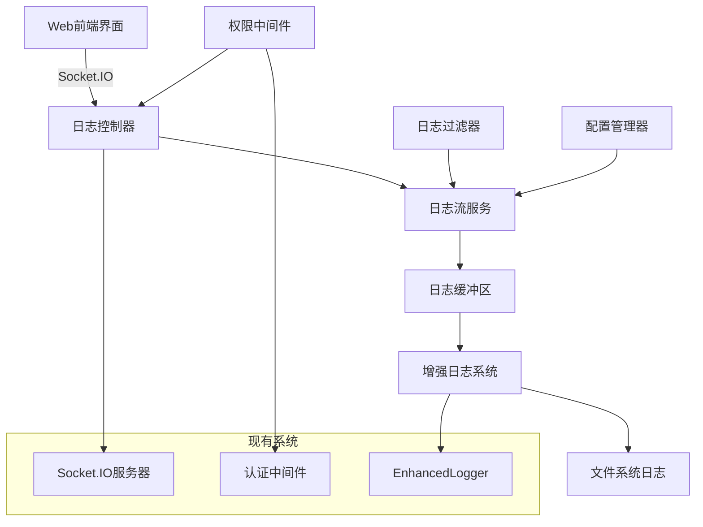

# 实时日志查看器设计文档

## 概述

实时日志查看器是一个基于 WebSocket 的日志监控系统，允许管理员通过 Web 界面实时查看、搜索和分析 Mio-Chat-Backend 的系统日志。该系统利用现有的 Socket.IO 基础设施，通过扩展当前的消息协议来实现高效的日志流传输。

## 架构

### 系统架构图



### 核心组件

1. **LogStreamController**: 处理日志相关的 Socket.IO 事件
2. **LogStreamService**: 管理日志流和缓冲区
3. **LogBuffer**: 内存中的日志缓冲区，支持快速查询和过滤
4. **LogFilter**: 日志过滤和搜索引擎
5. **LogWebInterface**: 前端日志查看界面

## 组件和接口

### 1. LogStreamController

负责处理来自前端的日志查看请求和权限验证。

```javascript
class LogStreamController {
  // 处理日志订阅请求
  handleLogSubscription(socket, options)
  
  // 处理日志搜索请求
  handleLogSearch(socket, query)
  
  // 处理日志导出请求
  handleLogExport(socket, options)
  
  // 处理配置更新
  handleConfigUpdate(socket, config)
}
```

### 2. LogStreamService

管理日志流的核心服务，负责日志的收集、缓存和分发。

```javascript
class LogStreamService {
  // 订阅日志流
  subscribe(clientId, options)
  
  // 取消订阅
  unsubscribe(clientId)
  
  // 推送日志到订阅者
  pushLog(logEntry)
  
  // 搜索历史日志
  searchLogs(query, options)
  
  // 获取日志统计信息
  getLogStats()
}
```

### 3. LogBuffer

高效的内存日志缓冲区，支持循环缓冲和快速查询。

```javascript
class LogBuffer {
  // 添加日志条目
  addLog(logEntry)
  
  // 获取日志范围
  getLogs(startIndex, endIndex)
  
  // 按条件过滤日志
  filterLogs(predicate)
  
  // 清理旧日志
  cleanup()
  
  // 获取缓冲区统计
  getStats()
}
```

### 4. Socket.IO 协议扩展

扩展现有的 Socket.IO 消息协议，添加日志相关的消息类型：

```javascript
// 客户端 -> 服务器
{
  protocol: 'logs',
  type: 'subscribe',
  data: {
    level: 'INFO',
    modules: ['llm', 'onebot'],
    realtime: true,
    bufferSize: 1000
  }
}

// 服务器 -> 客户端
{
  protocol: 'logs',
  type: 'stream',
  data: {
    timestamp: '2024-12-16T10:30:00.123Z',
    level: 'INFO',
    module: 'llm',
    message: '日志消息内容',
    caller: 'file.js:123',
    ip: '192.168.1.1'
  }
}
```

## 数据模型

### LogEntry

```javascript
interface LogEntry {
  id: string;           // 唯一标识符
  timestamp: Date;      // 时间戳
  level: LogLevel;      // 日志级别
  module: string;       // 模块名称
  message: string;      // 日志消息
  caller?: string;      // 调用者信息
  ip?: string;          // IP地址
  extra?: object;       // 额外数据
}
```

### LogLevel

```javascript
enum LogLevel {
  ERROR = 0,
  WARN = 1,
  MARK = 2,
  INFO = 3,
  DEBUG = 4
}
```

### LogSubscription

```javascript
interface LogSubscription {
  clientId: string;
  socket: Socket;
  options: {
    level: LogLevel;
    modules: string[];
    realtime: boolean;
    bufferSize: number;
    searchQuery?: string;
  };
}
```

## 正确性属性

*属性是一个特征或行为，应该在系统的所有有效执行中保持为真——本质上是关于系统应该做什么的正式声明。属性作为人类可读规范和机器可验证正确性保证之间的桥梁。*

### 属性 1: 实时日志推送延迟
*对于任何*生成的系统日志，LogStream 应该在 1 秒内将其推送到所有订阅的 WebInterface 客户端
**验证: 需求 1.2**

### 属性 2: 日志级别过滤正确性
*对于任何*选定的日志级别，LogFilter 返回的日志应该只包含该级别及更高优先级的日志条目
**验证: 需求 1.3**

### 属性 3: 缓冲区大小限制
*对于任何*超过设定限制的日志缓冲区，LogViewer 应该自动移除最旧的日志条目以保持在限制范围内
**验证: 需求 1.4**

### 属性 4: 暂停滚动状态保持
*对于任何*暂停滚动的状态，LogViewer 应该停止自动滚动但继续在后台接收和存储日志数据
**验证: 需求 1.5**

### 属性 5: 搜索关键词高亮
*对于任何*输入的搜索关键词，LogFilter 应该在所有包含该关键词的日志条目中正确高亮显示
**验证: 需求 2.1**

### 属性 6: 时间范围过滤
*对于任何*选定的时间范围，LogViewer 应该只显示时间戳在该范围内的日志条目
**验证: 需求 2.2**

### 属性 7: 模块过滤
*对于任何*选定的模块，LogFilter 应该只显示来源于该模块的日志条目
**验证: 需求 2.3**

### 属性 8: 导出文件内容一致性
*对于任何*当前过滤结果，导出的文件应该包含与界面显示完全一致的日志条目
**验证: 需求 2.4**

### 属性 9: 页面加载性能
*对于任何*管理员用户访问，日志页面应该在 2 秒内完成加载并显示初始日志内容
**验证: 需求 3.1**

### 属性 10: 日志级别颜色区分
*对于任何*不同级别的日志，LogViewer 应该使用不同的颜色样式进行视觉区分
**验证: 需求 3.2**

### 属性 11: 日志条目详情展示
*对于任何*被点击的日志条目，LogViewer 应该显示包含完整信息的详细视图
**验证: 需求 3.3**

### 属性 12: 长内容展开折叠
*对于任何*超过显示限制的日志内容，LogViewer 应该提供展开和折叠功能
**验证: 需求 3.4**

### 属性 13: 响应式布局适应
*对于任何*窗口大小变化，WebInterface 应该自动调整布局以适应新的尺寸
**验证: 需求 3.5**

### 属性 14: 非管理员访问拒绝
*对于任何*非管理员用户的访问请求，LogViewer 应该拒绝访问并返回权限不足的错误信息
**验证: 需求 4.1**

### 属性 15: 会话过期处理
*对于任何*过期的管理员会话，LogViewer 应该自动断开连接并要求重新认证
**验证: 需求 4.2**

### 属性 16: 敏感操作审计
*对于任何*敏感操作（如导出、配置更改），LogViewer 应该在审计日志中记录操作详情
**验证: 需求 4.3**

### 属性 17: 异常访问防护
*对于任何*检测到的异常访问模式，LogViewer 应该自动阻止访问并触发安全告警
**验证: 需求 4.4**

### 属性 18: 管理员认证验证
*对于任何*管理员登录请求，LogViewer 应该验证访问码的正确性后才允许访问
**验证: 需求 4.5**

### 属性 19: 日志保留数量配置
*对于任何*设置的日志保留数量，LogViewer 应该严格按照该数量限制内存中的日志条目
**验证: 需求 5.1**

### 属性 20: 刷新频率配置
*对于任何*配置的刷新频率，LogStream 应该按照该频率向客户端推送日志更新
**验证: 需求 5.2**

### 属性 21: 日志源启用禁用
*对于任何*启用或禁用的日志源，LogFilter 应该相应地包含或排除来自这些源的日志
**验证: 需求 5.3**

### 属性 22: 配置持久化
*对于任何*保存的配置更改，LogViewer 应该将配置数据持久化到本地存储中
**验证: 需求 5.4**

### 属性 23: 配置重置功能
*对于任何*配置重置操作，LogViewer 应该将所有设置恢复到系统默认值
**验证: 需求 5.5**

## 错误处理

### 1. 连接错误处理
- WebSocket 连接断开时自动重连
- 连接失败时显示友好的错误提示
- 网络异常时缓存日志数据，连接恢复后同步

### 2. 权限错误处理
- 未授权访问时重定向到登录页面
- 会话过期时自动清理本地状态
- 权限不足时显示明确的错误信息

### 3. 性能错误处理
- 日志量过大时自动启用分页
- 内存不足时清理旧日志数据
- 搜索超时时提供取消选项

### 4. 数据错误处理
- 日志格式错误时跳过并记录警告
- 搜索语法错误时提供修正建议
- 导出失败时提供重试机制

## 测试策略

### 单元测试
- LogBuffer 的循环缓冲逻辑
- LogFilter 的搜索和过滤算法
- 权限验证中间件
- 日志格式化和解析函数

### 集成测试
- Socket.IO 消息协议的完整流程
- 日志流从生成到显示的端到端测试
- 多客户端并发访问测试
- 权限系统与现有认证的集成

### 性能测试
- 大量日志数据的处理性能
- 多客户端同时订阅的负载测试
- 内存使用和垃圾回收测试
- 网络带宽使用优化测试

### 属性基础测试
使用 **fast-check** 库进行属性基础测试，每个测试运行最少 100 次迭代：

- 日志过滤和搜索的正确性验证
- 缓冲区管理的边界条件测试
- 权限控制的安全性验证
- 配置管理的一致性测试

每个属性基础测试必须使用以下格式标记：
`**Feature: real-time-log-viewer, Property {number}: {property_text}**`