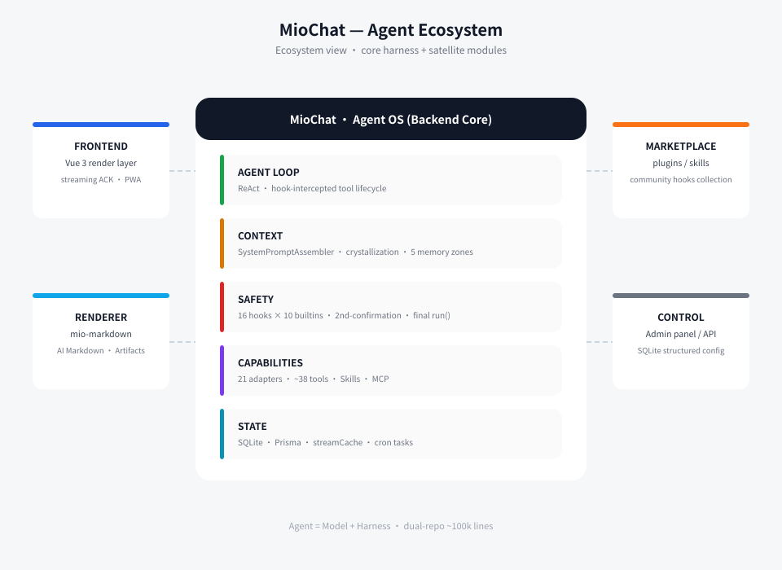
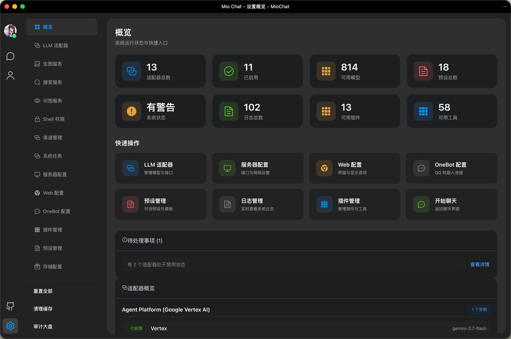

<div align="center">


**Not just a chat relay — the next-generation Agent OS.**

[](LICENSE)
[](https://nodejs.org/)
[](#quick-start)
[](#hooks)
[](https://github.com/Pretend-to/mio-chat-frontend)
[](#why-it-exists)

[**Live Demo**](https://ai.krumio.com) | [Docs](./docs/README.md) | [QQ Group](https://qm.qq.com/cgi-bin/qm/qr?_wv=1027&k=-r56TCEUfe5KAZXx3p256B2_cxMhAznC&authKey=6%2F7fyXh3AxdOsYmqqfxBaoKszlQzKKvI%2FahbRBpdKklWWJsyHUI0iyB7MoHQJ%2BqJ&noverify=0&group_code=798543340) | [**简体中文**](./README.md)

🖥️ [MioChat Frontend](https://github.com/Pretend-to/mio-chat-frontend) · 🎨 [Mio-Previewer (MD Renderer)](https://github.com/Pretend-to/mio-previewer) · 🔌 [Plugin Marketplace](https://github.com/Pretend-to/awesome-miochat-plugins)

</div>

---

Mio-Chat is a complete **Agent ecosystem** built from multiple modules:

| Module | Repository | Description |
| :--- | :--- | :--- |
| **Backend** | [Pretend-to/mio-chat-backend](https://github.com/Pretend-to/mio-chat-backend) | **(this repo)** core runtime, Hook architecture, plugin system |
| **Frontend** | [Pretend-to/mio-chat-frontend](https://github.com/Pretend-to/mio-chat-frontend) | immersive agent UI built on Vue 3 + Element Plus |
| **Renderer** | [Pretend-to/mio-markdown](https://github.com/Pretend-to/mio-markdown) | Markdown rendering engine deeply customized for AI, with Artifacts support |
| **Plugins** | [Pretend-to/awesome-miochat-plugins](https://github.com/Pretend-to/awesome-miochat-plugins) | official & community plugin / Skill / Hook collections |

## Why it exists

<details>
<summary><b>Agent = Model + Harness — the position this project is built on</b></summary>

Traditional AI chat platforms are little more than "API relay stations". **MioChat** is an **Agent Operating System** designed for complex production environments. Through precise context management, bidirectional security authorization, Multi-Agent orchestration and aspect-oriented Hook interception, it lets AI operate on the physical world autonomously *and* safely.

The core agent loop everyone uses is five lines of ReAct. The observable differences live entirely **outside** the loop: context management, permissions, tool contracts, streaming reliability, memory. MioChat owns all of those layers directly — model-agnostic, self-hosted, with nothing between the code and your machine. ~100k lines across two repositories are the difference between a demo and a system that runs unattended tasks without losing context, messages, or trust.

</details>

## Demo


## Architecture



## Highlights

### 📊 Unified Admin Settings & Observability Dashboard
Enterprise-grade global configuration management and full-link observability — no more black boxes or tangled config files.

- **Global System & Storage Engine**: Zero-downtime hot-switching between Local storage and S3-compatible Object Storage (AWS S3 / Cloudflare R2 / MinIO); system configs are persisted in SQLite and applied immediately via Web UI and REST API.
- **Dynamic Model Management**: Built-in LiteLLM dynamic sync engine (covering 3,200+ frontier and open-source models), supporting custom Providers, API Keys, Base URLs, context windows, and real-time Temperature tuning.
- **Observability Dashboard**: Real-time visual monitoring of throughput, Token consumption metrics (Prompt / Completion breakdown), latency distributions, and per-Agent conversation activities.



### 🔌 Hot-Pluggable Tools & Modern Plugin Architecture
Uniting cross-language open ecosystems with zero-downtime runtime extensibility.

- **Standardized Plugin Layout**: Clean separation of metadata, tools, and lifecycle hooks:
  ```text
  my-plugin/
  ├── plugin.json       # Plugin metadata (name, version, dependencies, permissions)
  ├── index.js          # Entrypoint (extends MioPlugin, manages lifecycle)
  ├── tools/            # Tools catalog (extends MioFunction, with Zod validation & final run guard)
  └── hooks/            # Interceptors mounted across 16 system-wide lifecycle hooks
  ```
- **Zero-Downtime Hot-Reload**: Dynamically load, unload, or hot-swap plugin code without restarting the backend; paired with the frontend **Tools Manager** to toggle individual tools or plugin packs per conversation.
- **Three-Layer Seamless Fusion**: Open standard **Agent Skills** (scans `.claude/`, `.cursor/`, `.gemini/`) + **MCP (Model Context Protocol)** adapter + native high-performance tools.

### 📱 Multi-Platform Channels (Beta — WeChat First)
Seamlessly embed Agents into real-world IM apps. *Currently in Beta stage, debuting with full native WeChat (iLink Bot) integration.*

- **WeChat iLink Instant Connect**: Generates a login QR code on the frontend. **Once confirmed on your phone, the backend automatically establishes credentials and spins up long-polling within seconds** — zero manual launch required.
- **Full Multimodal Decryption & Consumption**:
  - 🖼️ **Image Decryption**: AES-128-ECB ciphertext download and decipher -> Local/S3 storage -> Structured multimodal arrays with multi-turn image history playback.
  - 📄 **File Processing**: PDF / Word / Excel / code files ciphertext decipher -> Automatic Markdown links that drive the `parse` tool for autonomous deep extraction.
  - 🎙️ **Native Voice ASR**: Reads Tencent's native server-side ASR transcription text directly for millisecond-latency streaming responses.
- **1.2s Intelligent Debouncing Queue**: Tailored for high-frequency WeChat burst pushes — aggregates multi-image bursts, file-before-text, and split prompts into single unified requests, eliminating AI pre-replying and out-of-order execution.
- **Independent Soul & Memory Persistence**: Each Channel is mapped to a dedicated AgentId with isolated Soul persona, GlobalMem long-term facts, and session Crystal memories, supported by `/soul`, `/model`, and `/sessions` Slash commands.


### 🧠 Multi-Agent hybrid groups
Break the single-agent silo; run a swarm of heterogeneous LLMs and personas together.

- Add multiple Agents driven by different Channels into one group chat, side by side.
- `@`-directed responses or ordered/conditional multi-agent rounds — cross-perspective review for complex engineering problems.
- One shared message chain, N per-member context views (see Frontend).


### ❄️ Context engineering: "crystallization"
Solves the industry pain point of token explosion and context overflow in long conversations.

- **5 structured XML zones**: user profile, short-term goals, current plan, file-architecture deltas, and global constraints — isolated and normalized.
- **Stateless crystallization + prefix cache**: dynamically watches the token watermark, scans turn boundaries, distills redundant history into read-only memory fragments — engineered to hit Gemini/Claude prompt caches, cutting 80%+ token cost and first-token latency to milliseconds.


### 🛡 Safety: interactive tool suspension
Solves the loss-of-control problem when AI executes dangerous tools (shell commands, file deletion, public publishing).

- **Aspect-oriented mounting**: interception points exposed across the whole LLM + ReAct tool lifecycle.
- **Deferred-Promise suspension**: for sensitive operations the backend pauses the ReAct loop and pushes a second-confirmation card over WebSocket; the loop resumes only after the admin approves.


### ⏰ Autonomous tasks & scheduled inspection
Offline autonomy with a visual inspection dashboard.

- **Flexible scheduling**: standard Cron expressions, relative time, or one-shot (`once`) triggers with built-in anti-repetition guards.
- **Visual Task panel + secure sandbox**: inspect execution logs, wake tasks manually; per-task prompts and shell-command allowlists keep the agent from idling.


### 🎨 Artifacts & dynamic tool management
- **Artifacts canvas** with `mio-previewer`: independent preview of code, HTML, SVG, Mermaid diagrams and dynamic UI components — side-by-side interaction.
- **Tools Manager**: toggle tools / plugin groups in real time from the conversation UI.

## Hooks

Mio-Chat V3 is built around aspect-oriented interception. The **7 core mount points** (16 in total system-wide) let you control every step of the agent:

| Mount point | Purpose | Typical use |
| :--- | :--- | :--- |
| `LLM_BEFORE_CHAT` | conversation interception | sensitive-word filter, balance deduction, context injection |
| `LLM_BEFORE_RECURSION` | recursion-turn interception | dynamically adjust the tool list per turn, inject turn context |
| `TOOL_BEFORE_LOAD` | load audit | validate tool-name safety, prevent plugin conflicts |
| `TOOL_BEFORE_EXECUTE` | execution intervention | dynamic permission (RBAC), auto param repair, suspend interception |
| `LLM_AFTER_CHAT` | result audit | token usage persistence, response desensitization |
| `LLM_TOOL_RESULTS` | tool-call audit | record tool arguments & outputs after batch execution |
| `TOOL_NOT_FOUND` | smart fallback | strip MD5 suffix, lookup resolution, user guidance |

Backed by 10 built-in hooks (audit, rate-limit, response-size cap, permission checks, model permissions, param validation, …). Every tool runs through `MioFunction.run()` — guarded, content-hashed, timeout-bounded, and impossible to bypass via subclassing. See [Hooks guide](./docs/core/hooks.md).

## Frontend & Plugins

- **Frontend** — the render layer of the harness (streaming reliability, group-context isolation, client-side memory, hand-written PWA) lives in the **[mio-chat-frontend](https://github.com/Pretend-to/mio-chat-frontend)** repo.
- **Plugin / Skill / Hook collections** — official & community: **[awesome-miochat-plugins](https://github.com/Pretend-to/awesome-miochat-plugins)**.

## Quick start

```bash
git clone --depth 1 https://github.com/Pretend-to/mio-chat-backend.git
cd mio-chat-backend
pnpm install
pnpm start
pm2 logs mio-chat-backend
```

First launch auto-initializes the database and schema (built into `app.js` initialization). Then open the web UI and configure your LLM adapters / OneBot / plugins from the **admin panel** — all settings live in SQLite, surfaced through the UI & API.

Frontend (separate repo, syncs with backend models automatically):

```bash
git clone https://github.com/Pretend-to/mio-chat-frontend.git
cd mio-chat-frontend && pnpm install && pnpm dev
```

## Documentation

| Category | Links |
| :--- | :--- |
| **🚀 Quick Start & Deploy** | [Deployment Guide](./docs/deployment/RUNNING_GUIDE.md) \| [PM2](./docs/deployment/DEPLOYMENT.md) \| [Docker](./docs/deployment/DOCKER.md) \| [Config API](./docs/api/config-api.md) |
| **🧠 Core Mechanics** | [Context Crystallization](./docs/core/memory-crystallization.md) \| [Hooks](./docs/core/hooks.md) \| [Socket Protocol](./docs/api/socket_protocol_zod.ts) |
| **🛠️ Development** | [Plugin Guide](./docs/plugins/PLUGIN_DEVELOPMENT_GUIDE.md) \| [Skill Spec](./lib/chat/llm/skills/miochat-plugin-builder/SKILL.md) \| [Adapter Template](./docs/adapters/ADAPTER_TEMPLATE.js) |
| **🗄️ Archive** | [Architecture Migration](./docs/archive/MIGRATION.md) \| [Q&A](./docs/archive/FULL_PROJECT_QA.md) |

## Contributing

Mio-Chat evolves community-driven. Any contribution is welcome:

1. **Contribute a Plugin** — give agents the ability to operate new domains.
2. **Contribute a Skill** — crystallize expert knowledge for a specific domain.
3. **Contribute a Hook** — harden the defense & audit system.

## 🙏 Acknowledgements

Developed with JetBrains' **Open Source Development License** — free professional JetBrains IDE licenses provided for this open-source project.

[](https://www.jetbrains.com/)

## License

[MIT](LICENSE) — © 2026 MioChat contributors
