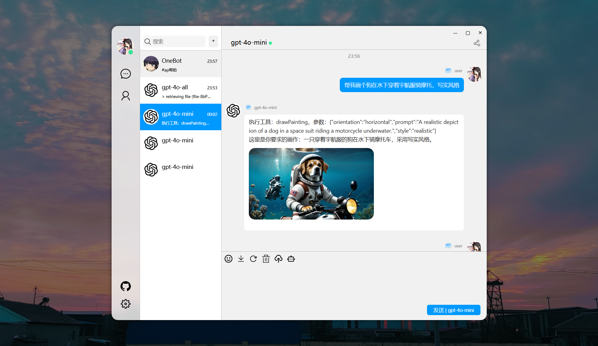
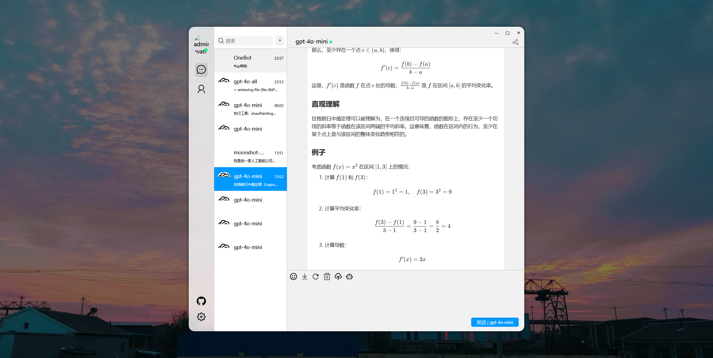
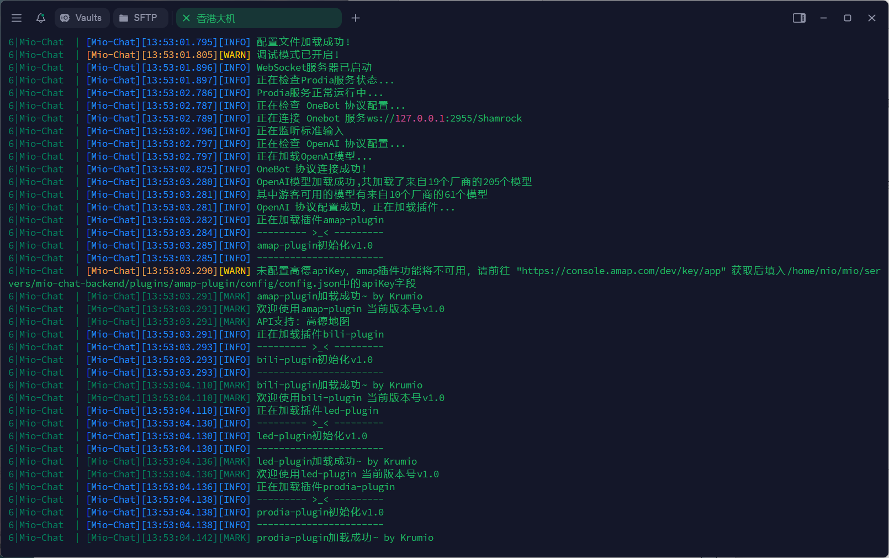

# Mio-Chat-Backend

主要是个AI平台，兼容OpenAI与**部分**Onebot协议v11。兼容原生态圈。

前端部分：[Mio-Chat 前端](https://github.com/Pretend-to/mio-chat-frontend)

QQ交流群：[qq 群](https://qm.qq.com/q/Eqv9Z6iSB4)

预览地址：[Mio-Chat](https://ai.krumio.com)

## 预览




## 特性

- ✅ 支持 OpenAI 协议的对话功能
- ✅ 支持 OpenAI 协议的 FunctionCall(ToolCall) 功能
- ✅ 支持 OpenAI 协议下的图片或文件上传分析
- ✅ 支持 Onebot 协议的对话功能
- ✅ 支持 Onebot 协议的多种消息类型
- ✅ 对于 OpenAI 协议具备可定制拓展的插件系统

## 安装

1. 克隆存储库：

```bash
git clone https://github.com/Pretend-to/mio-chat-backend
```

2. 进入项目目录：

```bash
cd mio-chat-backend
```

3. 安装依赖项：(请先确保你安装了NodeJS与Pnpm)

```bash
pnpm install
```

## 使用

1. 使用 node 启动后端服务器：

```bash
# 如果你要前台调试
node app
# 后台运行(基于 pm2)
npm run start
```

2. 修改配置文件，按配置文件的注释修改即可。


## 关联项目
[NextWeb](https://github.com/ChatGPTNextWeb/ChatGPT-Next-Web) by [Yda](https://github.com/Yidadaa)

[云崽相关内容](https://gitee.com/yhArcadia/Yunzai-Bot-plugins-index) by 云崽社区

[chatgpt-mirai-qq-bot](https://github.com/lss233/chatgpt-mirai-qq-bot) by [lss233](https://github.com/lss233)

## 日志
- 2024-3-01
  构建基本框架。
- 2024-3-10
  完善了基于 Prodia 的 API 接口，画图功能应该没问题了。前端还在重构中，所以现在也只能当个画图服务器用,暂时可以无限制嫖几十个sd高速接口。
- 2024-4-10
  继续完善后端，对于云崽 Lain 的对接基本完成，遗憾的是 Lain 跑路了。但是总是还有一些 fork 的，想用也能用。后续可能会顺带做一个云崽的插件？？？
- 2024-4-23
  后端基本接入OpenAI。流式响应基于异步迭代器实现，但还是存在一定响应式问题。
- 2024-4-24(5.14 补档)
  在 [NextWeb](https://github.com/ChatGPTNextWeb/ChatGPT-Next-Web) 作者 [Yda](https://github.com/Yidadaa) 的帮助下把流式问题解决了，感谢Yda。
- 2025-1-13
  Prodia 大更新，把 V1 的官方 API 给砍掉了，故本项目移除 prodia 相关内容。
## 贡献

欢迎贡献！如果您发现任何错误或有改进建议，请提出问题或提交拉取请求。

## 许可证

该项目根据[MIT许可证](LICENSE)许可。
