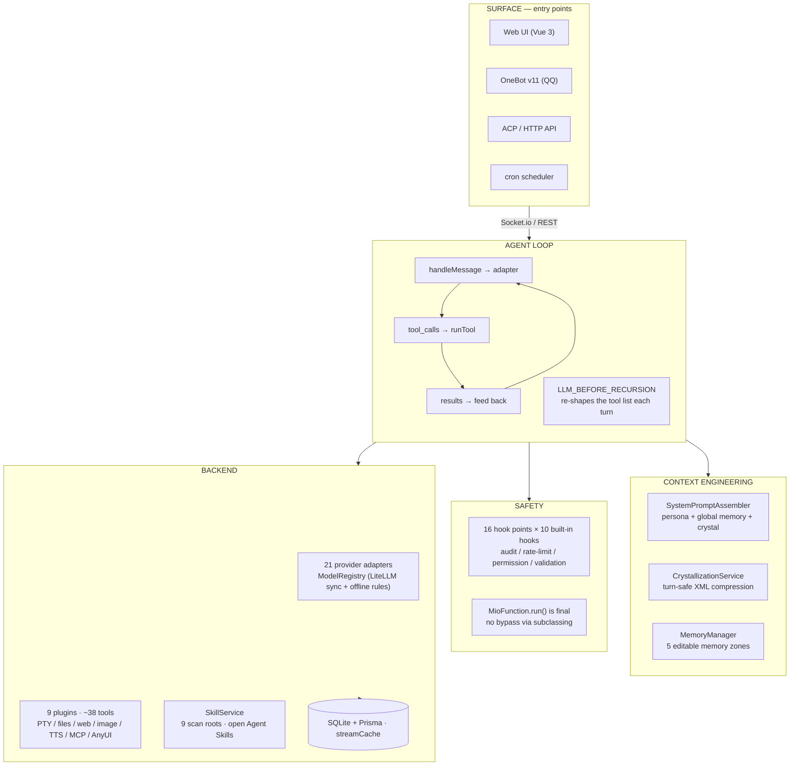

<div align="center">

# 🦞 MioChat

**English** · [中文](README.zh-CN.md)

[](#license)
[](https://nodejs.org/)
[](https://github.com/Pretend-to/mio-chat-frontend)
[](#why-it-exists)

**Agent = Model + Harness.** Most of what makes an agent reliable lives outside the model, in the harness wrapped around it — this repository *is* that harness, built from scratch.

</div>

**MioChat** is a self-hosted, model-agnostic agent orchestration platform. Not a wrapper around a single LLM API: a full harness with dynamic routing across 20+ provider adapters, a hook-interceptable tool lifecycle, turn-safe long-context compression ("crystallization"), multi-protocol entry points (Web / Socket.io / OneBot v11 / ACP / HTTP), and a frontend that carries half of the context engineering in the browser.

The core agent loop is five lines of ReAct. Everything else here — ~100k lines across two repositories — is the difference between a demo and a system that runs unattended tasks without losing context, messages, or trust.

## Why it exists

All mainstream agent products converge on the same loop: *call model → execute tool → feed the result back*. The observable differences live entirely **outside** the loop: context management, permissions, tool contracts, streaming reliability, memory. MioChat owns all of those layers directly — model-agnostic, self-hosted, with nothing between the code and your machine.

## Demo

<!-- 回填：把演示 GIF 放到 docs/assets/demo/demo.gif → 一键触发、多模型路由、跑工具、出卡片 UI -->


## Screenshots

<!-- 回填：把截图放到 docs/assets/screenshots/ 下即可（桌面端 / 移动端 / 管理后台）-->


## Architecture


```mermaid
flowchart TD
    subgraph SFC["SURFACE — entry points"]
        UI["Web UI (Vue 3)"]
        OB["OneBot v11 (QQ)"]
        ACP["ACP / HTTP API"]
        CRON["cron scheduler"]
    end

    subgraph LOOP["AGENT LOOP"]
        direction TB
        M["handleMessage → adapter"]
        T["tool_calls → runTool"]
        R["results → feed back"]
        M --> T --> R --> M
        ROT["LLM_BEFORE_RECURSION<br/>re-shapes the tool list each turn"]
    end

    subgraph CTX["CONTEXT ENGINEERING"]
        SPA["SystemPromptAssembler<br/>persona + global memory + crystal"]
        CRY["CrystallizationService<br/>turn-safe XML compression"]
        MM["MemoryManager<br/>5 editable memory zones"]
    end

    subgraph SAF["SAFETY"]
        H["16 hook points × 10 built-in hooks<br/>audit / rate-limit / permission / validation"]
        F["MioFunction.run() is final<br/>no bypass via subclassing"]
    end

    subgraph BE["BACKEND"]
        AD["21 provider adapters<br/>ModelRegistry (LiteLLM sync + offline rules)"]
        PL["9 plugins · ~38 tools<br/>PTY / files / web / image / TTS / MCP / AnyUI"]
        SK["SkillService<br/>9 scan roots · open Agent Skills"]
        DB[("SQLite + Prisma · streamCache")]
    end

    SFC -->|"Socket.io / REST"| LOOP
    LOOP --> CTX
    LOOP --> SAF
    LOOP --> BE
    BE --> DB
```

## Engineering highlights

### 1. A tool lifecycle that can be intercepted at every stage

Every tool runs through `MioFunction.run()` — guarded, content-hashed, and timeout-bounded. The system fires **16 hook points** across four lifecycles (tool / plugin / LLM / recursion), backed by **10 built-in hooks**: audit trails, rate limits, response-size caps, permission checks, parameter validation, and unknown-tool recovery — `tool:notFound` returns a structured fallback result instead of crashing the turn.

### 2. Model-agnostic by design

21 provider adapters (OpenAI, Anthropic, Gemini ×2 auth modes, DeepSeek, Zhipu, MiniMax, xAI, Groq, OpenRouter, Volcengine, StepFun, Baichuan, Kuaishou, Meituan, GitHub Models, Perplexity, Xiaomi MiMo, 01.AI, …) share one registry. `ModelRegistryService` syncs LiteLLM's capability/pricing table (China-CDN-mirrored) **and** ships built-in rule tables so the system boots correctly with zero network access.

### 3. Context engineering: "crystallization"

Long conversations are compressed by a stateless **crystallization** service: it scans frontend *turn* boundaries (never cutting a half-finished tool-call dialogue), rolls history into an XML summary with **five zones** (user profile / short-term goals / current plan / file deltas / constraints), and keeps the latest turn verbatim. Memory zones are CRUD-able by the agent via a `memory` tool — and visually editable by the user.

### 4. Reliability as a protocol, not a promise

Streamed chunks are buffered server-side (`streamCache`) and replayed on reconnect. On the client, a message is only ACKed **after** it survives persistence (`localforage`); failed persistence means no ACK, so the server keeps the buffer and resyncs on next entry. An 80ms `StreamBuffer` throttle batches store writes to avoid Safari OOM on high-frequency repaints.

## Frontend

The client half of the harness — streaming reliability, group-context isolation, client-side memory engineering, hand-written PWA — lives in the **[mio-chat-frontend](https://github.com/Pretend-to/mio-chat-frontend)** repository. It is not a chat skin; it participates in the harness.

## Plugins & tools

| Plugin | Tools | Notes |
|---|---|---|
| `ai-plugin` | 7 | search / vision / image draw / memory / cron scheduler / tool management |
| `file-editor-plugin` | 9 | read / write / replace / batch / grep / tree / insert / append |
| `terminal-pty` | 3 | real PTY sessions (node-pty), 512KB output truncation, session reaping |
| `web-plugin` | 6 | fetch / crawl / browser mgmt / pdf / publish / share |
| `mcp-plugin` | — | Model Context Protocol client (stdio / HTTP / SSE) |
| `anyui-plugin` | 3 | agent-authored UI templates rendered in Shadow DOM |
| `edge-tts` / `config` / `skill` | 9 | TTS, dynamic config forms, skill management |

Skills follow the open **Agent Skills** standard; `SkillService` scans your `.claude/`, `.cursor/` and `.gemini/` skill directories — skills written for other agents install here as-is.

## Quick start

No `.env` editing required — **all configuration is managed from the web console** (stored in SQLite, surfaced through the admin panel / API).

```bash
git clone git@github.com:Pretend-to/mio-chat-backend.git && cd mio-chat-backend
pnpm install
pnpm db:push
pnpm dev                      # http://127.0.0.1:3080

# 1. open the web UI
# 2. sign in, open Settings / Admin
# 3. add your LLM adapter instances (OpenAI / Anthropic / DeepSeek / Gemini …)
#    — no .env, no restart, everything hot-reloads in the UI
```

Frontend (separate repo, clones or matches backend models automatically):

```bash
git clone git@github.com:Pretend-to/mio-chat-frontend.git && cd mio-chat-frontend
pnpm install
pnpm dev                      # http://localhost:1314, proxies /socket.io & /api to :3080
```

## Repository layout

```
mio-chat-backend/
├── lib/
│   ├── chat/llm/         adapters, skills, crystallization, model registry
│   ├── chat/onebot/      OneBot v11 (QQ) bridge
│   ├── chat/acp/         Agent Client Protocol with process management
│   ├── hooks/            16 hook points + built-in hooks
│   ├── plugins/          9 built-in plugins (PTY, MCP, AnyUI, TTS…)
│   ├── server/           Express 5 + Socket.io runtime
│   └── database/         Prisma + SQLite services
├── prisma/               schema
├── docs/                 architecture, RFCs, assets
└── config/               PM2 runtime config
```

## Project status

A personal research/engineering project, developed openly on `master` — **no external users yet**. Every subsystem is nevertheless built to production standard (audit hooks, rate limits, graceful shutdown, zero-downtime PM2 reloads, multi-arch Docker image pipeline). It exists to prove a position: **the harness is the product**.

## Documentation

- `docs/architecture/` — RFCs (e.g., multimodal capability abstraction)
- `docs/adapters/` · `docs/plugins/` · `docs/deployment/`

## 🙏 Acknowledgements

Developed with JetBrains' **Open Source Development License** — free professional JetBrains IDE licenses provided for this open-source project.

[](https://www.jetbrains.com/)

## License

[MIT](LICENSE) — © 2026 MioChat contributors
