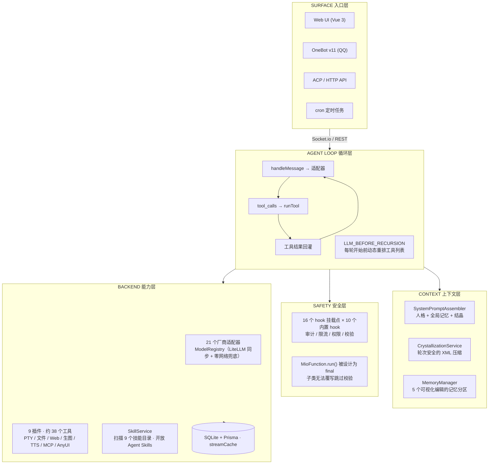

<div align="center">

# 🦞 MioChat

[English](README.md) · **中文**

[](#license)
[](https://nodejs.org/)
[](https://github.com/Pretend-to/mio-chat-frontend)
[](#为什么做它)

**Agent = 模型 + Harness。** 决定一个 agent 靠不靠谱的，往往不是模型本身，而是模型周围那一层 harness——本仓库就是那层 harness，从零亲手写的。

</div>

**MioChat** 是一款自托管、模型无关的 Agent 编排平台。它不是某个 LLM API 的封装壳，而是一套完整的 harness：20+ 厂商适配器 + 动态模型路由、每个环节都可被 hook 拦截的工具生命周期、不会切断 tool_calls 对话的长上下文压缩（"结晶"）、多协议入口（Web / Socket.io / OneBot v11 / ACP / HTTP），以及一个承担了一半上下文工程的前端。

核心循环只是五行 ReAct。而这里（前后端两个仓库、约 10 万行）的所有其他代码，正是"能演示"与"能无人值守跑任务而不丢上下文、不丢消息、不丢信任"之间的全部差距。

## 为什么做它

主流 agent 产品的核心循环趋于同构：*调模型 → 执行工具 → 把结果喂回去*。可感知的差异全部发生在循环**之外**：上下文管理、权限、工具契约、流式可靠性、记忆。MioChat 想做的，是把这些层全部握在自己手里——模型无关、自托管、中间没有任何黑盒。

## 演示

<!-- 回填：把演示 GIF 放到 docs/assets/demo/demo.gif → 一句话触发、多模型路由、跑工具、出卡片 UI -->


## 截图

<!-- 回填：把截图放到 docs/assets/screenshots/ 下即可（桌面端 / 移动端 / 管理后台）-->


## 架构



## 工程亮点

### 1. 每个环节都可被拦截的工具生命周期

所有工具都走 `MioFunction.run()`——带守卫、内容哈希命名、超时兜底的唯一执行路径。系统在四个生命周期（工具 / 插件 / LLM / 递归轮次）上提供了 **16 个 hook 挂载点**，内置 **10 个 hook**：审计、限流、响应长度上限、权限校验、参数校验、未知工具纠错——`tool:notFound` 会返回结构化兜底结果而不是让整个回合崩掉。

### 2. 模型无关

21 个厂商适配器共享一套注册表：OpenAI、Anthropic、Gemini（两种鉴权）、DeepSeek、智谱、MiniMax、xAI、Groq、OpenRouter、火山引擎、阶跃、百川、快手、美团、GitHub Models、Perplexity、小米 MiMo、零一 … `ModelRegistryService` 同步 LiteLLM 的模型能力/价格表（国内 CDN 镜像优先），同时内置规则表——**零网络也能正确冷启动**。

### 3. 上下文工程：结晶

长对话由无状态的"结晶"服务压缩：先扫描**前端轮次边界**（绝不拦腰切断 tool_calls 的半截对话），再把历史滚成带 **5 个分区**的 XML 摘要（用户画像 / 短期目标 / 运行计划 / 文件变更 / 开发约束），最近一轮原文完整保留。记忆分区既可以被 agent 通过 `memory` 工具 CRUD，也可以被用户在界面上可视化编辑。

### 4. 可靠性是协议，不是承诺

流式 chunk 在服务端 `streamCache` 缓冲、断线重连回放；客户端**先落盘（localforage）成功再 ACK**，落盘失败不发 ACK、服务端保留缓存等你下次进来同步；`StreamBuffer` 以 80ms 节流批量写 store，防止 Safari 高频重绘 OOM 崩溃。

## 前端

harness 的客户端半边——流式可靠性、群聊上下文隔离、客户端记忆工程、手写 PWA——都在独立的 **[mio-chat-frontend](https://github.com/Pretend-to/mio-chat-frontend)** 仓库中。它不是聊天皮肤，它参与 harness 本身。

## 插件与工具

| 插件 | 工具数 | 说明 |
|---|---|---|
| `ai-plugin` | 7 | 搜索 / 识图 / 生图 / 记忆 / cron 定时 / 工具管理 |
| `file-editor-plugin` | 9 | read/write/replace/batch/grep/tree/insert/append |
| `terminal-pty` | 3 | 真实 PTY 会话（node-pty），512KB 输出截断，空闲回收 |
| `web-plugin` | 6 | fetch / crawl / 浏览器管理 / pdf / publish / share |
| `mcp-plugin` | — | MCP 协议客户端（stdio / HTTP / SSE） |
| `anyui-plugin` | 3 | agent 生成的 UI 模板，Shadow DOM 渲染 |
| `edge-tts` / `config` / `skill` | 9 | 语音合成 / 动态配置表单 / 技能管理 |

技能遵循开放 **Agent Skills** 标准，`SkillService` 扫描 `.claude/`、`.cursor/`、`.gemini/` 技能目录——给其他 agent 写好的技能，这里原样能装。

## 快速开始

**不需要修改 `.env`** —— 所有配置都通过 Web 管理面板管理（结构化存储在 SQLite，由后台/API 下发）。

```bash
git clone git@github.com:Pretend-to/mio-chat-backend.git && cd mio-chat-backend
pnpm install
pnpm db:push
pnpm dev                      # http://127.0.0.1:3080

# 1. 打开 Web UI
# 2. 登录，进入 设置 / 管理后台
# 3. 在页面上添加你的 LLM 适配器实例（OpenAI / Anthropic / DeepSeek / Gemini…）
#    —— 无需 .env，无需重启，全部热加载
```

前端（独立仓库，自动同步后端模型列表）：

```bash
git clone git@github.com:Pretend-to/mio-chat-frontend.git && cd mio-chat-frontend
pnpm install
pnpm dev                      # http://localhost:1314，代理 /socket.io 与 /api 到 :3080
```

## 仓库布局

```
mio-chat-backend/
├── lib/
│   ├── chat/llm/         适配器、技能、结晶、模型注册表
│   ├── chat/onebot/      OneBot v11（QQ）桥接
│   ├── chat/acp/         Agent Client Protocol + 独立进程管理
│   ├── hooks/            16 个挂载点 + 内置 hook
│   ├── plugins/          9 个内置插件（PTY、MCP、AnyUI、TTS…）
│   ├── server/           Express 5 + Socket.io 运行时
│   └── database/         Prisma + SQLite 服务层
├── prisma/               schema
├── docs/                 架构、RFC、资源
└── config/               PM2 运行配置
```

## 项目状态

个人研究/工程级项目，直接在 `master` 上开放开发——**目前没有外部用户**。但每个子系统都按生产标准构建：审计 hook、限流、优雅关闭、PM2 零停机 reload、多架构 Docker 镜像流水线。它存在是为了验证一个立场：**harness 才是产品**。

## 文档

- `docs/architecture/` —— RFC（如多模态能力抽象）
- `docs/adapters/` · `docs/plugins/` · `docs/deployment/`

## 🙏 致谢

本项目使用 JetBrains **开源项目开发许可证**进行开发——感谢 JetBrains 为本开源项目提供的免费专业 IDE 许可证。

[](https://www.jetbrains.com/)

## 许可证

[MIT](LICENSE) —— © 2026 MioChat contributors
