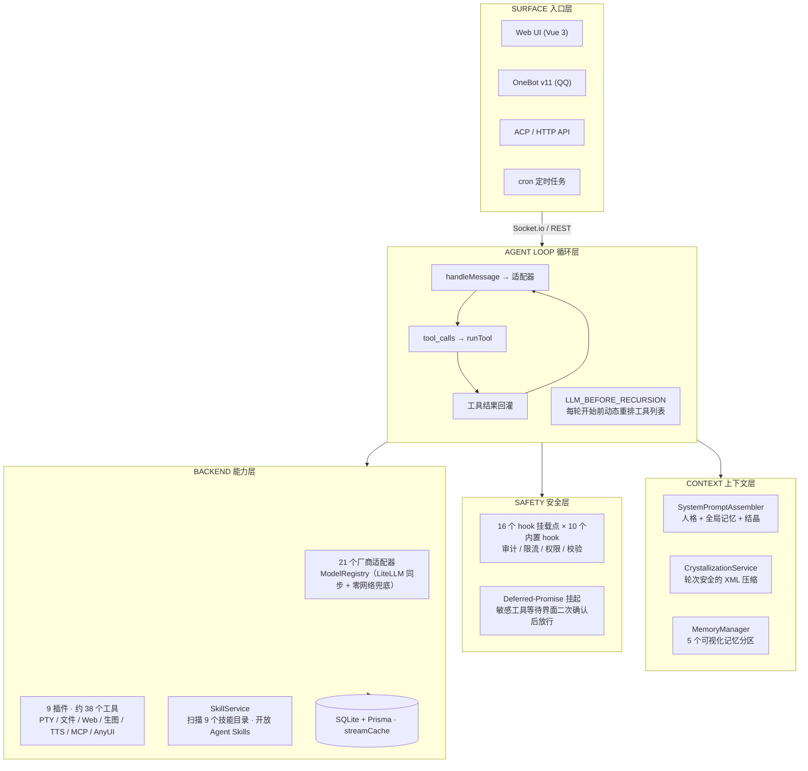
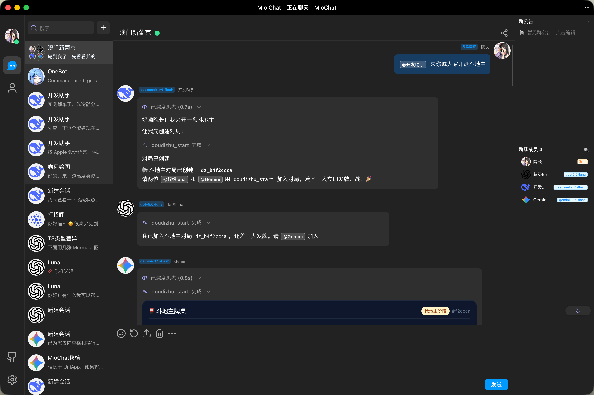
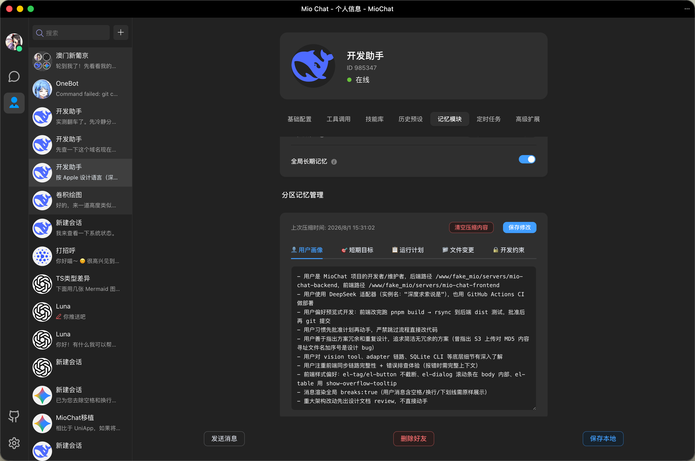
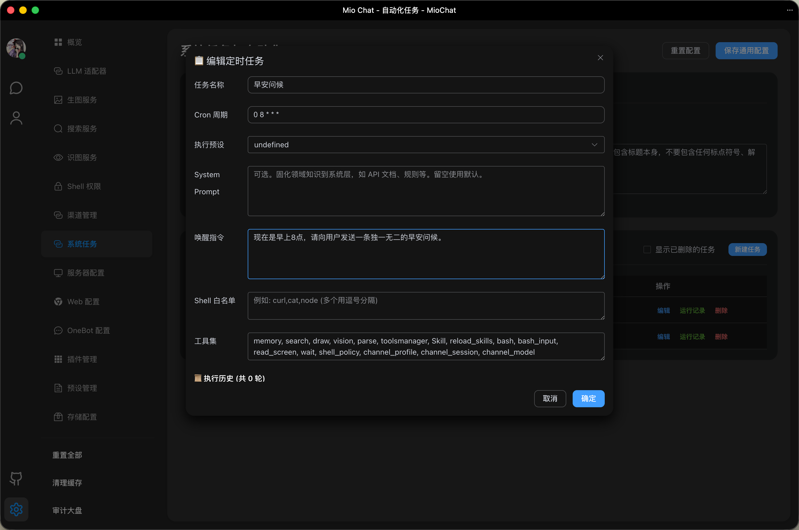

<div align="center">


**不仅仅是对话转发，更是下一代 Agent 操作系统**

[](LICENSE)
[](https://nodejs.org/)
[](#快速开始)
[](#hooks-机制)
[](https://github.com/Pretend-to/mio-chat-frontend)
[](#为什么做它)

[**在线演示**](https://ai.krumio.com) | [文档中心](./docs/README.md) | [QQ 交流群](https://qm.qq.com/cgi-bin/qm/qr?_wv=1027&k=-r56TCEUfe5KAZXx3p256B2_cxMhAznC&authKey=6%2F7fyXh3AxdOsYmqqfxBaoKszlQzKKvI%2FahbRBpdKklWWJsyHUI0iyB7MoHQJ%2BqJ&noverify=0&group_code=798543340)

🖥️ [Mio-Chat Frontend](https://github.com/Pretend-to/mio-chat-frontend) · 🎨 [Mio-Previewer (MD 渲染器)](https://github.com/Pretend-to/mio-previewer) · 🔌 [插件市场](https://github.com/Pretend-to/awesome-miochat-plugins)

</div>

---

Mio-Chat 是一个由多个模块构成的完整 Agent 生态系统：

| 模块 | 仓库地址 | 说明 |
| :--- | :--- | :--- |
| **Backend** | [Pretend-to/mio-chat-backend](https://github.com/Pretend-to/mio-chat-backend) | **(当前仓库)** 核心运行环境、Hook 架构、插件系统 |
| **Frontend** | [Pretend-to/mio-chat-frontend](https://github.com/Pretend-to/mio-chat-frontend) | 基于 Vue 3 + Element Plus 的沉浸式 Agent 交互界面 |
| **Renderer** | [Pretend-to/mio-markdown](https://github.com/Pretend-to/mio-markdown) | 专为 AI 深度定制的 Markdown 渲染引擎，支持 Artifacts |
| **Plugins** | [Pretend-to/awesome-miochat-plugins](https://github.com/Pretend-to/awesome-miochat-plugins) | 官方及社区维护的插件、Skill、Hook 集合仓库 |

## 为什么做它

<details>
<summary><b>Agent = 模型 + Harness —— 这个项目立起来的立场</b></summary>

传统的 AI 对话平台仅仅是简单的"API 搬运工"。**MioChat** 是专为复杂生产环境设计的 **Agent 操作系统**。它通过精密的上下文管理、双向安全授权、Multi-Agent 多智能体协同和面向切面的 Hook 拦截机制，让 AI 能够真正地、自主地、安全可控地操作物理世界。

大家都在用的核心 agent 循环只有五行 ReAct。可感知的差异全部发生在循环**之外**：上下文管理、权限、工具契约、流式可靠性、记忆。MioChat 想做的，是把这些层全部握在自己手里——模型无关、自托管、中间没有任何黑盒。前后端两个仓库约 10 万行代码，正是"能演示"与"能无人值守跑任务而不丢上下文、不丢消息、不丢信任"之间的全部差距。

</details>

## 演示

<!-- 回填：演示 GIF → docs/assets/demo/demo.gif（一句话 → 多模型路由 → 工具执行 → 渲染 UI）-->


## 架构



## 特性亮点

### 🧠 多 Agent 混合群组
打破单 Agent 孤岛，实现异构 LLM 与多元人格的集群智慧。

- 支持在同一个群聊中加入多个不同 Channel 驱动的 Agent 本尊。
- 支持 @指定 Agent 响应或多 Agent 顺序/条件触发讨论，实现复杂工程问题下的多视角交叉审核与协作。
- 一条共享消息链、N 个成员各自的上下文视图（见前端）。

<!-- 截图回填：多 Agent 群聊讨论界面 → docs/assets/screenshots/group-chat.png -->


### ❄️ 上下文工程：记忆结晶
解决长对话 Token 暴增与上下文溢出的行业痛点。

- **5 大 XML 结构化分区**：将用户画像、短期目标、当前计划、工程结构增量与全局约束规范化隔离。
- **无状态结晶与前缀缓存**：动态判定 Token 水位线，扫描对话轮次边界，自动将冗余历史提炼为只读 Memory Fragment，极限命中 Gemini / Claude 的 Prompt Cache，降低 80%+ Token 开销，首字延迟缩短至毫秒级。

<!-- 截图回填：记忆结晶 / 压缩状态界面 → docs/assets/screenshots/crystallization.png -->


### 🛡 安全：交互式工具挂起
解决 AI 自主执行危险工具（如 Shell 命令、文件删除、公网发布）时的安全失控难题。

- **面向切面挂载**：在 LLM 推理与 ReAct 工具循环的生命周期中暴露核心拦截切面。
- **Deferred Promise 异步挂起**：判定为敏感操作时，后端创建 Deferred Promise 暂停 ReAct 循环，并通过 WebSocket 向前端推送二次确认卡片；待管理员点击放行后，唤醒 Promise 继续推进流程。

<!-- 截图回填：敏感工具二次确认卡片 → docs/assets/screenshots/tool-suspend.png -->


### ⏰ 定时任务与后台巡检
赋予 Agent 离线自治与可视化巡检能力。

- **灵活调度**：支持标准 Cron 表达式、相对时间与单次触发。
- **可视化面板与安全沙盒**：前端提供专用的 Task 管理面板，可直观查看执行日志与手动唤醒；后端支持设置任务专属 Prompt 与 shell 命令白名单，防止 Agent 陷入无意义的用户交互等待。

<!-- 截图回填：定时任务与后台 Agent 巡检界面 → docs/assets/screenshots/cron-task.png -->


### 🔌 三层可插拔生态
兼顾专家经验、跨语言标准与高性能运行时工具。

- **Skills 专家经验指南 + MCP 协议 + Native Plugins 运行时热重载**（9 个内置插件 / 约 38 个工具）。
- **Zod 参数拦截与 AI 自纠错**：工具参数通过 Zod Schema 进行严格校验。当 LLM 传递非法参数时，系统自动捕捉报错并喂回大模型，触发 LLM 零人工干预自动修正参数。
- 技能遵循开放 **Agent Skills** 标准：`SkillService` 扫描 `.claude/` / `.cursor/` / `.gemini/` 技能目录——给其他 agent 写好的技能，这里原样能装。

### 🎨 Artifacts 与动态工具管理
- **Artifacts 画板交互**：结合 `mio-previewer`，实现代码、HTML 网页、SVG 矢量图、Mermaid 流程图及动态 UI 组件的独立画板预览与分屏交互。
- **Tools Manager 动态调配**：前端支持在会话中实时感知与开关指定的工具或插件组，随心所欲调配 Agent 技能库。

## Hooks 机制

Mio-Chat V3 采用面向切面编程的设计理念。通过一系列生命周期钩子，你可以精准控制 Agent 的每一步操作。**7 个核心挂载点**（全系统共 16 个）：

| 挂载点 | 作用 | 典型应用场景 |
| :--- | :--- | :--- |
| `LLM_BEFORE_CHAT` | 对话拦截 | 敏感词过滤、余额预扣费、Context 注入 |
| `LLM_BEFORE_RECURSION` | 递归轮次拦截 | 按工具调用轮次动态调整工具列表、注入轮次上下文 |
| `TOOL_BEFORE_LOAD` | 加载审计 | 校验工具名称安全性、防止插件冲突 |
| `TOOL_BEFORE_EXECUTE` | 执行干预 | 权限动态校验 (RBAC)、参数自动修复、挂起拦截 |
| `LLM_AFTER_CHAT` | 结果审计 | Token 用量落库、响应内容脱敏 |
| `LLM_TOOL_RESULTS` | 工具调用审计 | 批量工具执行完成后记录工具参数与出参详情 |
| `TOOL_NOT_FOUND` | 智能纠错 | 剥离 MD5 后缀自动寻址、用户引导提示 |

另有 10 个内置 hook（审计、限流、响应长度上限、权限校验、模型权限、参数校验…）。所有工具都走 `MioFunction.run()`——带守卫、内容哈希命名、超时兜底，且该方法是 final，**无法通过子类覆写绕过校验**。详情参考：[📖 Hooks 开发指南](./docs/core/hooks.md)。

## 前端与插件

- **前端**——harness 的渲染层（流式可靠性、群聊上下文隔离、客户端记忆、手写 PWA）在独立的 **[mio-chat-frontend](https://github.com/Pretend-to/mio-chat-frontend)** 仓库。
- **插件 / Skill / Hook 集合**——官方及社区维护：[**awesome-miochat-plugins**](https://github.com/Pretend-to/awesome-miochat-plugins)。

## 快速开始

```bash
git clone --depth 1 https://github.com/Pretend-to/mio-chat-backend.git
cd mio-chat-backend
pnpm install
pnpm start
pm2 logs mio-chat-backend
```

首次启动会自动完成数据库与 schema 初始化（内置在 `app.js` 初始化链路中）。随后打开 Web UI，在**管理面板**中配置你的 LLM 适配器 / OneBot / 插件即可——所有设置结构化存储于 SQLite，通过界面与 API 管理。

前端（独立仓库，自动同步后端模型列表）：

```bash
git clone https://github.com/Pretend-to/mio-chat-frontend.git
cd mio-chat-frontend && pnpm install && pnpm dev
```

## 文档

| 分类 | 内容大纲 |
| :--- | :--- |
| **🚀 快速开始** | [完整部署与玩法](./docs/deployment/RUNNING_GUIDE.md) \| [PM2 部署](./docs/deployment/DEPLOYMENT.md) \| [Docker 部署](./docs/deployment/DOCKER.md) \| [配置指南](./docs/api/config-api.md) |
| **🧠 核心机制** | [上下文压缩原理](./docs/core/memory-crystallization.md) \| [Hooks 拦截机制](./docs/core/hooks.md) \| [Socket 协议](./docs/api/socket_protocol_zod.ts) |
| **🛠️ 开发指南** | [插件开发手册](./docs/plugins/PLUGIN_DEVELOPMENT_GUIDE.md) \| [Skill 编写规范](./lib/chat/llm/skills/miochat-plugin-builder/SKILL.md) \| [Adapter 模板](./docs/adapters/ADAPTER_TEMPLATE.js) |
| **🗄️ 归档资料** | [架构迁移历史](./docs/archive/MIGRATION.md) \| [常见问题 Q&A](./docs/archive/FULL_PROJECT_QA.md) |

## 贡献

我们欢迎任何形式的贡献。Mio-Chat 的演进由社区驱动：

1. **贡献 Plugin**：赋予 Agent 操作新领域工具的能力。
2. **贡献 Skill**：沉淀特定领域的专家经验指南。
3. **贡献 Hook**：完善系统的防御与审计体系。

## 🙏 致谢

本项目使用 JetBrains **开源项目开发许可证**进行开发——感谢 JetBrains 为本开源项目提供的免费专业 IDE 许可证。

[](https://www.jetbrains.com/)

## 许可证

[MIT](LICENSE) —— © 2026 MioChat contributors
