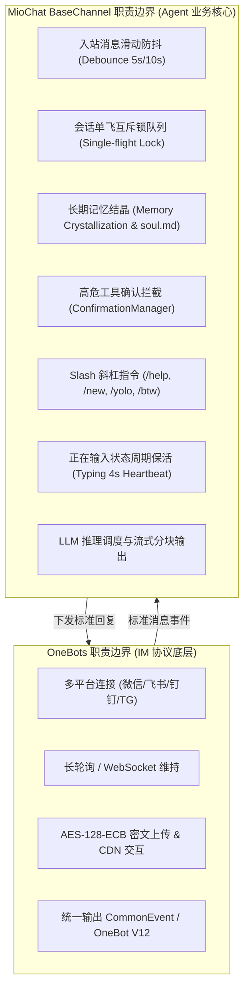

# OneBots (多平台协议转换框架) 深度调研与技术可行性评估报告

> **编制日期**：2026-09-07  
> **调研目标**：评估 [OneBots](https://onebots.pages.dev/)（代码库：`https://github.com/lc-cn/onebots`）作为 MioChat Channel 体系底层协议驱动的技术可行性与落地路径。  
> **核心诉求**：满足用户零外部容器/独立进程依赖，“`git clone` 下来 `pnpm dev` 就能跑”的单进程交付理念。

---

## 1. 调研背景与核心问题定义

### 1.1 现状与痛点
MioChat 的 `channels/` 渠道体系旨在让用户可以通过外部 IM 平台（微信、飞书、钉钉、Telegram 等）直接与 MioChat 的 AI 智能体互动。
迁移前曾基于微信官方 iLink HTTP 协议自主实现首个渠道（`IlinkClient.js` + `WechatChannel.js`）；该实现现已由内嵌 OneBots 接管。

然而，手写各平台私有底层协议存在巨大维护成本：
1. **协议逆向与频繁变更**：非官方或闭源协议（如微信 iLink）缺少公开稳定文档，存在字段漂移、IDC 节点变更、加解密算法更迭等风险；
2. **多平台边际成本高**：每个新平台（飞书、钉钉、TG、Discord、Slack）都需要手写一套长轮询/WebSocket、消息解包、媒体上传、Token 刷新的胶水代码；
3. **媒体处理复杂度极高**：例如微信 CDN 上传需要先计算 MD5、生成 AES 密钥、进行 AES-128-ECB 密文填充加密、换取预签名并直传腾讯 CDN，逻辑冗长且易错。

### 1.2 调研标的：OneBots
OneBots 是基于 TypeScript / Node.js 研发的开源项目（原 OICQ / ICQQ 核心作者凉菜主导），定位为 **“M 平台 $\to$ N 协议”的即时通讯机器人协议中台**。
- **官网与文档**：[https://onebots.pages.dev/](https://onebots.pages.dev/)
- **源码仓库**：`https://github.com/lc-cn/onebots` (MIT License)

---

## 2. OneBots 源码级工程架构剖析

通过对 OneBots 源码（TypeScript Monorepo）进行深入检视，其系统结构高度分层：

```
onebots (pnpm monorepo, Node >= 24, TypeScript 5.9)
├── packages/
│   ├── core/         # 核心应用内核 (BaseApp / Account / Registry / Router)
│   ├── imhelper/     # 客户端 SDK (支持 WS / WSS / Webhook / SSE / Manual 模式)
│   ├── onebots/      # 主入口脚手架与运行时
│   └── web/          # 可选的 Web 控制台与 TUI 工具
├── adapters/         # 26 个平台适配器（实现 Adapter 基类，输出 CommonEvent）
│   ├── adapter-wechat-clawbot/  # 微信 ClawBot (iLink Bot HTTP)
│   ├── adapter-feishu/          # 飞书官方开放平台
│   ├── adapter-dingtalk/        # 钉钉机器人
│   ├── adapter-telegram/        # Telegram Bot API
│   ├── adapter-qq/              # QQ 开放平台
│   ├── adapter-discord/         # Discord Gateway
│   └── ... (共计 26 个平台)
└── protocols/        # 协议转换与对外暴露层
    ├── onebot-v11/   # OneBot V11 协议标准实现
    ├── onebot-v12/   # OneBot V12 协议标准实现
    ├── satori-v1/    # Satori 协议实现
    ├── milky-v1/     # Milky 协议实现
    └── mcp-v1/       # Model Context Protocol 工具调用协议
```

### 2.1 数据流向与分层契约
1. **适配器层 (Adapter Layer)**：每个适配器（如 `adapter-wechat-clawbot`）只负责连接平台底层 API、捕获平台原生数据包，将其解包标准化为统一的 `CommonEvent`，并执行通用动作（发送消息、上传媒体等）。
2. **账号层 (Account Layer)**：管理具体平台账号实例，维护在线/离线状态机与重连退避，持久化 Session 票据。
3. **协议层 (Protocol Layer)**：将内部的 `CommonEvent` 转换输出为行业标准协议（OneBot V11/V12、Satori 等），并通过 HTTP/WebSocket 供下游业务消费。
4. **客户端 SDK (`imhelper`)**：提供统一的 Client 封装，应用层代码只需通过 `imhelper` 监听 `message.private`、`message.group` 并调用 `sendMessage`，彻底无需关心底层具体是微信还是飞书。

### 2.2 迁移前适配器源码对照：`adapter-wechat-clawbot` vs MioChat 旧 `IlinkClient.js`
迁移评估曾对 OneBots 的 `adapters/adapter-wechat-clawbot/src/sdk` 与 MioChat 当时自研的 `channels/wechat/IlinkClient.js` 进行比对：

| 特性维度 | MioChat 现存 `IlinkClient.js` | OneBots `adapter-wechat-clawbot` | 差异与优势评估 |
| :--- | :--- | :--- | :--- |
| **底层协议接口** | `ilinkai.weixin.qq.com` | `ilinkai.weixin.qq.com` | 两者对接的是完全相同的微信官方 iLink HTTP 通道 |
| **加解密算法** | AES-128-ECB | AES-128-ECB | 完全一致 |
| **媒体上传** | `getuploadurl` + 直传 novac2c CDN | `getuploadurl` + 直传 novac2c CDN | 完全一致，且 OneBots 包含媒体下载解密工具 `downloadRecentMedia` |
| **登录与扫码** | 仅支持长轮询二维码 | 支持终端二维码、图片 URL、手机数字配对码、过期自动重扫码 | OneBots 登录流更全面、容错性更高 |
| **网络故障恢复** | 简单 timeout 忽略 | 细粒度拦截 `ENOTFOUND`、`ECONNRESET`、`ETIMEDOUT` 等 10+ 类瞬时网络故障并实施指数退避 | OneBots 容灾与心跳设计更健壮 |
| **IDC 自动换源** | 固定单域名 | 支持识别服务端重定向并自动切换 IDC 节点 | 具备更好的网络鲁棒性 |
| **输入状态反馈** | `sendTyping` (status 1/2) | 扩展动作 `send_typing` (支持 active/idle) | 核心功能一致 |

---

## 3. MioChat Channel 与 OneBots 的分层契合度

### 3.1 核心认知：MioChat `BaseChannel` 不可被 OneBots 替代
MioChat 的 Channel 绝不是一个简单的“消息转发器”，它本质上是一个 **AI Agent 业务控制中枢**。



- **MioChat 拥有独特的 Agent 特性**：
  1. **防抖合并 (Debounce)**：微信用户习惯发“碎嘴消息”（如连发“你好”、“在吗”、“看下这张图”）。MioChat 的 `BaseChannel` 设立了 5 秒文本 / 10 秒多媒体滑动防抖窗口，合并后才交由 LLM 处理。OneBots 作为协议层不会也不能做这种带有业务假设的防抖。
  2. **会话单飞互斥锁 (Single-Flight)**：同一个用户的会话严禁并发调用 LLM，必须串行排队。
  3. **记忆结晶与人设系统**：`MemoryStore` 维护长期记忆文件和动态会话状态。
  4. **高危操作确认拦截 (ConfirmationManager)**：AI 在执行危险工具（如 Shell `rm -rf`）时挂起，直接向微信发送确认提示，并在此层拦截用户的“1/确认”。
- **结论**：**OneBots 应当作为 MioChat 的“协议驱动层（Driver Layer）”，替换掉手写的底层 Client，而上层的 `BaseChannel` 业务机制必须 100% 完整保留。**

---

## 4. 落地架构方案对比：方案 A (Sidecar) vs 方案 B (库级内嵌)

| 评估维度 | 方案 A：独立 Sidecar 进程 / Docker 容器 | 方案 B：代码库直接引入 (In-Process Embedded) |
| :--- | :--- | :--- |
| **部署便利性** | 需维护独立进程、端口配置或 `docker-compose` | **极佳**。用户 `git clone` 下来执行 `pnpm dev` 单进程直接跑通 |
| **进程隔离性** | **高**。第三方平台网络断连/协议崩溃不波及主进程 | 需在代码内做好异常边界与 `try...catch` 隔离 |
| **环境兼容性** | 各自独立，OneBots 容器走 Node 24，主服务可用任意版本 | **需提升基线**。MioChat 后端运行环境需统一提升至 **Node.js >= 24** |
| **前后端集成** | 需增加跨进程/跨端口服务发现机制 | **直接内存调用**。前端扫码绑定的二维码与状态流可直接内存同步 |
| **整体契合度** | 适合复杂多节点生产部署 | **完全符合本项目用户“开箱即用”的设计哲学** |

针对用户的明确倾向，**正式确立选用方案 B（库级单进程内嵌）**。

---

## 5. 关键技术点可行性论证

### 5.1 Node.js 24 运行时环境升级可行性
- **现状**：MioChat 后端原本的 `package.json` 声明为 `"engines": ">=20.19.0 || >=22.12.0 || >=24.0.0"`，宿主开发机当前实际已安装并运行在 **Node.js v24.13.0**。
- **现有依赖兼容性测试**：
  - `better-sqlite3`: v12.9.0 原生支持 Node 24；
  - `prisma`: v7.9.0 原生支持 Node 24；
  - `express`: v5.2.1 原生支持 Node 24。
- **结论**：将运行环境基线明确提升至 Node 24 无技术阻碍。

### 5.2 扫码登录流在管理端（前端 UI）的无感衔接
- **问题**：当前前端 `ChannelManagerView.vue` 通过 `/api/channels/:id/qrcode` 和 `/api/channels/:id/poll` 完成微信扫码。OneBots 会不会破坏这一体验？
- **源码分析**：
  在 `adapter-wechat-clawbot` 的 `WechatIlinkBot` 中，生成二维码时会向外触发 `qr` 事件：
  ```ts
  this.emit("qr", { qrCodeUrl: loginSession.qrCodeUrl, qrcode: loginSession.qrcode });
  ```
- **解决方案**：
  在内嵌的 `OneBotsGateway` 模块中，订阅指定账号的 `qr` 事件，将二维码 URL / 数据缓存在内存中；当前端轮询 `/qrcode` 时直接返回。当扫码成功，OneBots 触发账号上线状态，`/poll` 立即返回 `confirmed`，**实现前端代码 100% 零修改的平滑兼容**！

### 5.3 Typing（正在输入）心跳机制
- MioChat `BaseChannel` 在防抖缓冲期和 LLM 思考生成期，需要维持微信端 4 秒一次的“正在输入”心跳。
- OneBots 的 ClawBot 适配器通过 `send_typing` 平台扩展动作暴露了该能力，且在底层会自动维护 `typing_ticket`。MioChat 通过 OneBot 协议调用该扩展动作即可维持心跳。

---

## 6. 最终评估结论

1. **采纳可行性**：**极高（A+）**。OneBots 的代码质量、类型定义完整度以及对 26 个平台适配器的沉淀，极大地补足了 MioChat 拓展多渠道的基础设施短板。
2. **研发收益**：
   - 彻底摆脱微信 iLink 协议的逆向与维护包袱；
   - 编写 1 个通用的 `OneBotChannel`，即刻打通飞书、钉钉、Telegram 等 20+ 个渠道，完全释放团队核心生产力；
   - 保持“单进程开箱即用”的高质感用户体验。
