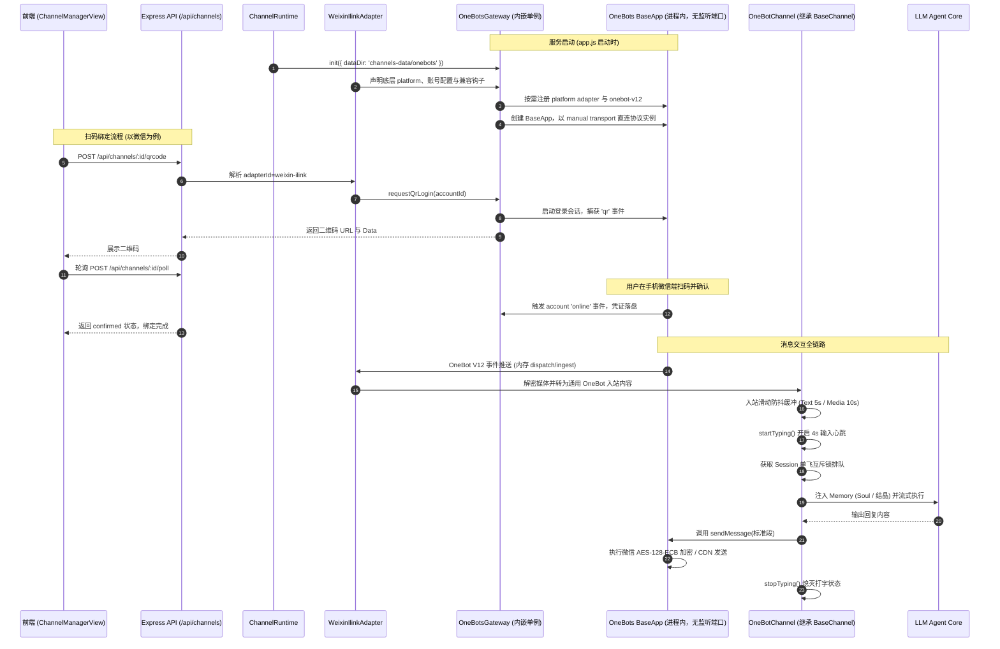

# OneBots 库级内嵌驱动集成开发指南 (方案 B)

> **版本**：v1.0.0  
> **编制日期**：2026-09-07  
> **适用范围**：MioChat Channel 渠道子系统（`channels/`）底层协议驱动重构  
> **运行环境**：Node.js >= 24.0.0 (单进程模型)

---

## 1. 架构总览与分层设计

为了贯彻 **“零外部中间件，git clone 下来 pnpm dev 单进程直接运行”** 的开发体验，我们将 OneBots 作为库级模块直接引入主应用中，由 `ChannelRuntime` 纳管其生命周期。



---

## 2. 核心模块规划与职责边界

在未来的代码实施阶段，渠道层将新增并重构以下关键模块：

```
channels/
├── common/
│   ├── BaseChannel.js         # 现有的统一 Agent 抽象基类 (保持 100% 稳定，防抖/单飞锁/确认/记忆)
│   ├── ConfirmationManager.js # 高危工具调用挂起与确认
│   └── SlashHandler.js        # /help, /new, /yolo, /btw 斜杠指令
├── onebots/                   # [新增] OneBots 驱动层集成目录
│   ├── OneBotsGateway.js      # 进程内 OneBots 单例管理器（不含平台特例）
│   ├── OneBotChannel.js       # 继承 BaseChannel 的通用 OneBot 渠道适配器
│   └── config.js              # OneBots 运行时配置常量与端口策略
├── weixin-ilink/              # MioChat 微信 iLink 渠道适配器
│   ├── WeixinIlinkChannel.js  # 微信媒体、context token 等渠道行为
│   ├── OneBotsBridge.js       # ClawBot 配置、session 与入站兼容钩子
│   └── index.js               # 适配器描述及工厂
├── ChannelAdapterRegistry.js  # 渠道发现、创建协议与旧标识映射
├── ChannelRuntime.js          # [重构] 渠道运行时生命周期管控 (纳管 OneBotsGateway 与各渠道实例)
└── ChannelStore.js            # 渠道配置存储 (SQLite / JSON)
```

### 2.1 OneBotsGateway (内嵌网关单例)
- **定位**：Node.js 内部唯一的 OneBots 运行时代理，负责与 OneBots 的 `BaseApp` 打交道。
- **职责**：
  1. **进程内传输**：不启动 OneBots HTTP/WS 监听；V12 事件通过 `dispatch -> ingest`、动作通过 `protocol.apply()` 在内存中直接传递；
  2. **适配器按需加载**：根据上层渠道适配器声明动态导入 OneBots platform 包，网关不硬编码微信或 QQ；
  3. **协议提供**：注册 `@onebots/protocol-onebot-v12` 协议转换器；
  4. **扫码事件汇聚中心**：
     - 维护一个内存 Map：`qrSessions: Map<accountId, { qrCodeUrl, qrcode, status, timer }>`；
     - 监听各账号的 `qr` 事件，暂存二维码数据；
     - 监听账号 `online` 与 `credential_stale` 事件，驱动管理面板轮询状态。

### 2.2 OneBotChannel (通用业务渠道)
- **定位**：继承自 `BaseChannel`，作为连接 OneBots 协议层与 MioChat Agent 业务层的标准桥梁。
- **职责**：
  1. **底层通信**：使用官方客户端 `@imhelper/onebot-v12` 的 `manual` 接收模式，无 socket 和端口占用；
  2. **消息入站**：接收 `message.private` 和 `message.group`，解构文本与媒体段，推入 `this.enqueueInboundDebounce()`；
  3. **下行发送**：
     - 实现 `doSendMessage`：调用 `client.sendMessage(...)` 发送文本；
     - 实现 `doSendImage`：构造 OneBot V12 Image Segment 发送（支持 Local Path / URL / Base64）；
     - 实现 `doSendTyping`：调用 OneBots 平台的 `send_typing` 动作（维持输入心跳）。

---

## 3. 详细接口设计与生命周期约定

### 3.0 渠道数据模型与历史兼容

新渠道使用正交字段描述运行时、平台适配器和协议，避免把 OneBots 与微信实现绑定：

```json
{
  "type": "weixin-ilink",
  "adapterId": "weixin-ilink",
  "driver": "onebots",
  "platform": "wechat-clawbot",
  "protocol": "onebot.v12",
  "config": {}
}
```

- `type` / `adapterId` 表示 MioChat 渠道适配器；
- `driver` 表示底层运行时；`platform` 对应 OneBots adapter 名称；
- `protocol` 表示 MioChat 边界协议，当前支持 `onebot.v12`；
- `config` 无损保存 adapter 专属配置。

历史 `type=wechat` 及 `type=onebots + platform=wechat-clawbot` 记录读取时解析为 `weixin-ilink` 适配器，无需数据迁移或重新扫码。`MIO_WECHAT_DRIVER` 已废弃且不再控制路由。

### 3.1 OneBotsGateway 规范签名
```ts
export class OneBotsGateway {
  /** 初始化并启动内部 OneBots 实例 */
  async init(options?: { port?: number, logLevel?: string }): Promise<void>;

  /** 动态注册并启动一个账号 */
  async startAccount(channelConfig: {
    id: string;
    type: string; // MioChat 适配器，例如 'weixin-ilink'、'qq-bot'
    driver: 'onebots';
    platform: string; // OneBots 底层 platform，例如 'wechat-clawbot'
    protocol: 'onebot.v12';
    config?: Record<string, any>;
    credentials?: Record<string, any>;
  }): Promise<void>;

  /** 停止并注销一个账号 */
  async stopAccount(channelId: string): Promise<void>;

  /** 获取正在等待扫码的二维码凭证 */
  getQrCode(channelId: string): { qrCodeUrl: string; qrcode: string; status: string } | null;

  /** 销毁内部服务（在应用退出时调用） */
  async dispose(): Promise<void>;
}
```

### 3.2 渠道发现与创建 API

管理端不得硬编码 OneBots 平台列表。创建前先请求 `GET /api/channels/catalog`，根据返回的 `adapters[].configSchema` 渲染配置表单，再提交版本化请求。响应暂时同时返回同内容的 `platforms` 字段，以兼容旧版前端：

```json
{
  "version": 1,
  "adapter": {
    "id": "weixin-ilink",
    "runtime": "onebots",
    "protocol": "onebot.v12"
  },
  "profile": {
    "name": "微信助手",
    "agentId": "wechat-master",
    "provider": "Vertex",
    "model": "gemini-2.5-pro"
  },
  "config": {
    "outbound_text_format": "markdown"
  }
}
```

后续平台在自己的目录（如 `channels/qq-bot/`）导出渠道定义，再通过 `registerChannelAdapter()` 注册名称、认证方式、能力、配置 schema、OneBots platform 和平台桥接钩子。OneBots 层只负责协议与账号运行时，不包含微信或 QQ 的业务逻辑。旧版扁平 `POST /api/channels` 请求继续兼容。

### 3.3 ChannelRuntime 联动改造
在 `ChannelRuntime.js` 中：
```js
export class ChannelRuntime {
  constructor(opts) {
    this.channelStore = opts.channelStore;
    this.onebotsGateway = new OneBotsGateway();
    // ...
  }

  async init() {
    // 1. 初始化并启动内嵌 OneBots 网关
    await this.onebotsGateway.init();
    // 2. 恢复需要开机自启的运行中渠道
    await this.restoreRunningChannels();
  }

  async start(channelId) {
    const channel = await this.channelStore.get(channelId);
    // 判断若为 OneBots 纳管平台：
    const adapter = resolveChannelAdapter(channel);
    await this.onebotsGateway.startAccount(channel, adapter);
    const chn = adapter.createChannel({
      channelId,
      gateway: this.onebotsGateway,
      memory: await this.createMemory(channel.agentId),
      // 注入 Agent 基础配置
    });
    await chn.start();
    this.running.set(channelId, { chn, channel });
    return chn;
  }
}
```

---

## 4. 依赖项与 Node 24 适配指南

### 4.1 package.json 依赖清单
在进入代码落地时，需在 `package.json` 中配置：

```json
{
  "engines": {
    "node": ">=24.0.0"
  },
  "dependencies": {
    "onebots": "1.2.12",
    "@onebots/protocol-onebot-v12": "3.0.12",
    "@onebots/adapter-wechat-clawbot": "3.0.12",
    "@imhelper/onebot-v12": "1.0.9",
    "imhelper": "1.0.9"
  }
}
```

### 4.2 环境与构建考量
- **Node.js 24 兼容性**：OxLint、Prettier 以及现存测试套件（`node:test`）在 Node 24 下表现优异；
- **原生模块**：`better-sqlite3`（v12.9.0）在 Node 24 环境下已有完备的预编译二进制或 node-gyp 支持，无需额外 C++ 补丁；
- **配置持久化**：嵌入式网关配置与 SQLite 数据存放在 `channels-data/onebots/`；当前上游 `wechat-clawbot` 会话凭证仍按其约定存放在 `data/wechat-clawbot/<account_id>.json`，两个目录均已被 Git 忽略。

---

## 5. 多平台横向扩展规范 (飞书 / Telegram / 钉钉)

得益于 OneBots 对 26 个平台的统一抽象，当后续需要新增渠道时，开发者仅需：

1. **新增独立渠道目录**：创建 `channels/<adapter-id>/`，实现渠道类、OneBots 桥接钩子与描述信息；
2. **注册渠道适配器**：通过 `registerChannelAdapter()` 注册，前端会根据 catalog 自动展示，并根据 schema 渲染凭据表单：
   - 飞书：`app_id`、`app_secret`、`verification_token`
   - Telegram：`bot_token`
   - 钉钉：`client_id`、`client_secret`
3. **后端 `ChannelStore`**：
   直接将凭据字典存储至 `channel.credentials` 字段中；
4. **复用通用能力**：平台渠道类继承 `OneBotChannel`，只覆盖认证、媒体或平台扩展动作；通用收发、防抖与 LLM 管线无需重复实现。

---

## 6. 后续演进路线

通用 OneBots 底座、微信 iLink 独立适配器和管理端动态 catalog 已落地。后续按以下顺序扩展：

- **微信回归**：持续覆盖二维码登录、旧凭证复用、Markdown、图片和文件收发；
- **新增第二渠道**：以 `channels/qq-bot/` 为模板验证注册机制、配置 schema 和平台扩展动作；
- **抽象稳定后**：视实际平台差异继续下沉通用逻辑，但不把平台特例反向放入 `channels/onebots/`。
