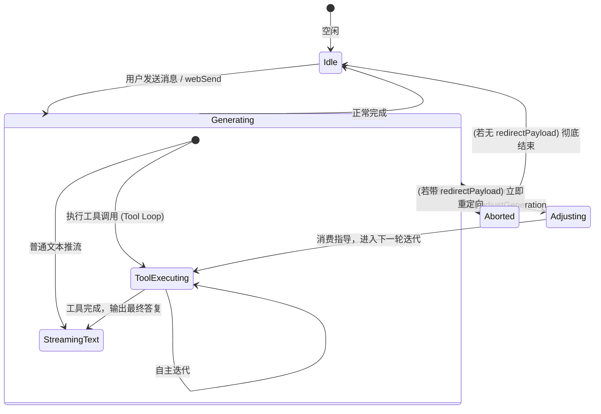

# 长任务实时干预与转向（Steering & Abort-and-Redirect）UX 与交互设计规范

> 状态：设计评审中  
> 适用端：Web 前端 (`mio-chat-frontend`)、IM 渠道端 (`mio-chat-backend/channels`)  
> 核心目标：拉通 Web 与 Channel 体验，对齐长任务/工具递归中的实时干预（Steering）与打断转向（`/abort <新内容>`）心智。

---

## 1. 为什么需要长任务干预？

在引入工具调用循环（Tool Loops）、自主 Agent 工作流及深度思考后，AI 单次回答可能持续数十秒甚至数分钟。用户在此过程中往往产生三种真实诉求：

1. **强行中止并改换方向（Abort & Redirect）**：
   - *“AI 查错方向了，或者我改变主意了，不需要它继续执行旧任务，立刻停下并按我新说的做。”*
   - 典型代表：Channel 侧已有的 `/abort <新内容>`。
2. **轻量引导与注入调整（Steering / Adjust）**：
   - *“AI 的大方向是对的，但在搜索过程中漏掉了一个关键限制条件。我不希望中断已有进度重新来过，只希望在下一个工具执行前补充一句指导。”*
   - 典型代表：`ChatEvent.adjust(text)` 机制。
3. **旁路轻插话（Side-channel / Btw）**：
   - *“主任务慢慢跑，我想先顺便问个简单的无关问题（如算个汇率），不要影响主任务。”*
   - 典型代表：Channel 侧已有的 `/btw <内容>`。

本规范重点定义 **强截断转向（Abort & Redirect）** 与 **轻量注入（Steering）** 在 Web 与 Channel 两个终端的统一 UX 与交互契约。

---

## 2. 统一的用户心智模型与概念定义

| 维度 | 强截断转向 (Abort & Redirect) | 轻量注入调整 (Steering / Adjust) | 旁路轻插话 (Btw) |
| :--- | :--- | :--- | :--- |
| **用户直觉** | “停！改做这个” | “等下，补充一个要求，接着干” | “顺便问一句，你继续做你的” |
| **对当前任务影响** | 彻底销毁当前 Agent 执行链，保存已产出片段并标记为`已中止` | 当前 Agent 执行链**不中断**，在下一工具步骤无缝合入用户新指令 | 当前任务正常运行，后台并发瞬态子任务，快速回复 |
| **上下文留存** | 中止前的消息作为历史对话保存，新消息另起一轮 | 融入当前轮次的递归上下文中，不另起对话轮次 | 独立会话/不计入主记忆或轻量计入 |
| **典型触发方式** | Web: 正在生成时点击“打断并发送”或发 `/abort xxx`<br>Channel: `/abort xxx`、`/stop xxx` | Web: 正在生成且包含工具循环时点击“转向注入”或快捷键<br>Channel: 任务执行中发送带引导前缀的消息 | Web: 快捷弹窗/独立小窗<br>Channel: `/btw xxx` |

---

## 3. Web 端交互设计 (UI/UX 规范)

### 3.1 核心痛点与体验升级
- **现状**：生成中输入框虽未完全锁死，但发送按钮与生成状态割裂；用户若中途输入新内容，只能先在聊天记录里找“停止”按钮，再回到底部点“发送”。
- **目标体验**：**生成中随时可输入，输入后一键打断并发送，支持无缝转向与注入。**

### 3.2 输入框与动作按钮的状态矩阵

```
┌────────────────────────────────────────────────────────────────────────┐
│                              输入区状态机                              │
└────────────────────────────────────────────────────────────────────────┘
                                     │
                 ┌───────────────────┴───────────────────┐
                 ▼                                       ▼
        [AI 空闲 / 静止状态]                    [AI 正在生成 / 长任务中]
                 │                                       │
                 ▼                                       ▼
        输入框: "输入消息..."                   输入框: 保持可用!
        按钮: [ 发送 ]                          提示语: "AI正在生成中，可直接输入进行干预..."
                                                         │
                                        ┌────────────────┴────────────────┐
                                        ▼                                 ▼
                                  [输入框为空]                      [输入框有文字]
                                        │                                 │
                                        ▼                                 ▼
                                   按钮状态 A:                       按钮状态 B:
                                 [ ⏹ 停止生成 ]                 [ ⏹ 打断并发送 ▾ ]
                                                               (主按钮: Abort & Send)
                                                               (下拉/副动作: 注入调整 Steering)
```

#### 状态 A：AI 正在生成中 + 输入框为空
- **按钮文案**：`⏹ 停止生成`（Danger/红色或橙色高亮风格）。
- **行为**：点击立即触发 `interruptGeneration`，终止当前生成，AI 状态转为完成/已中止，按钮恢复为默认灰度 `发送`。

#### 状态 B：AI 正在生成中 + 输入框有用户输入
- **主按钮（默认点击 / Enter 快捷键）**：`⏹ 打断并发送` (Abort & Send)。
  - **交互效果**：
    1. 立即给当前正在流式生成的 AI 消息打上 `aborted` 标识，冻结当前气泡。
    2. 类似 Channel 的 `/abort <arg>`，将输入框的文字立即作为最新一轮用户消息发送出去。
    3. 全流程无顿挫感：用户按下 Enter 的一瞬间，上一个长任务戛然而止，新任务立即开启。
- **副按钮 / 智能分流（当处于 Agent 工具循环中时）**：
  - 若当前任务正在执行多步工具调用（Tool Loop），在“打断并发送”旁边显示微型分割操作（或按键 `Alt + Enter`）：
  - **操作**：`💡 运行时注入 (Steering)`。
  - **行为**：不杀掉当前任务，而是调用 `adjustGeneration`，在输入框清空后，当前思考/工具卡片下方浮现一条轻量的“已注入指导提示条”。

### 3.3 消息流渲染规范

#### 1. 打断并转向（Abort & Redirect）的气泡呈现
```markdown
┌─ AI 助手 (执行中被打断) ──────────────────────────────┐
│ 正在搜索 2026 年最新政策...                            │
│ [工具: web_search] 已检索 2 个页面                    │
│                                                        │
│ ⏹ [已中止: 用户发起新指令]                             │
└────────────────────────────────────────────────────────┘

┌─ 我 (0.1秒后) ─────────────────────────────────────────┐
│ 停下来，先不用查政策了，帮我查下昨天的汇率变化         │
└────────────────────────────────────────────────────────┘

┌─ AI 助手 (新任务) ─────────────────────────────────────┐
│ 好的，我为您查询昨日汇率...                            │
└────────────────────────────────────────────────────────┘
```

#### 2. 运行时轻量注入（Steering / Adjust）的卡片呈现
```markdown
┌─ AI 助手 (连续任务中) ─────────────────────────────────┐
│ 正在检索跨平台方案...                                  │
│ [工具: web_search("cross-platform 2026")]              │
│                                                        │
│ 💡 用户注入指导: "只需关注 macOS 和 Linux，排除 Windows"│
│                                                        │
│ 了解，已收窄检索范围，接下来分析 macOS 与 Linux 平台...│
│ [工具: web_search("macOS Linux cross-platform")]       │
└────────────────────────────────────────────────────────┘
```

### 3.4 Web 侧 Slash 命令对齐
Web 端的 `InputEditor.vue` 现已支持斜杠命令补全（如 `/cmd`）。为让多端习惯彻底统一，在 Web 端同样内置以下斜杠指令：
- `/abort [新话题]` 或 `/stop [新话题]`：输入后即使点普通回车，也会严格以“打断并转新任务”协议执行。
- `/btw <短问题>`：即便在生成中，也能快速发起旁路问答。

---

## 4. Channel (IM / CLI) 端交互设计

Channel 端已在 `SlashHandler.js` 中实现了 `/abort <arg>` 的基础逻辑。在此基础上做进一步的 UX 体验打磨：

### 4.1 指令与自然语言支持
1. **显式指令**：
   - `/abort` 或 `/stop`：
     - 单独发送：终止当前会话，回复：`⏹️ 已中止当前正在执行的任务`。
     - 附带内容（如 `/abort 换个话题，讲个笑话`）：终止前序任务，立即无缝开启新话题，无需用户二次确认。
2. **自然语言打断容错（Smart Steering）**：
   - 当用户在 IM 群/私聊中，发现 AI 正在长篇大论或疯狂调用工具，用户常常不会输入 `/abort`，而是随手发一句：“算了别搜了”、“先停下”、“不对不对”。
   - **机制**：
     - 在 Channel 任务队列锁排队时，若检测到任务运行中收到短消息，进行轻量模式匹配（正则检测强打断词：`/^(停|别|不要|暂停|打断|取消|算了|换个|不对)/`）。
     - 若命中且任务支持 Steering：自动将该短文本作为 `event.adjust(text)` 喂入 Agent 工具循环；
     - 若不命中或模型正处于文本推流中：按常规排队或提示用户“任务正在处理中，发送 `/abort <内容>` 可立即打断并重定向”。

---

## 5. 协议与状态机时序设计

### 5.1 状态机流转



### 5.2 Socket 契约扩展 (Web ↔ Backend)

#### 1. 打断并转向 (`interruptGeneration` 增强)
```typescript
// 前端发送到 Socket
socket.emit('interruptGeneration', {
  messageId: string,          // 当前被中止的消息 ID
  contactorId: string,        // 会话目标
  redirect?: {                // [新增可选] 打断后立即开启的新会话内容
    text: string,
    messageId: string,        // 新用户消息的前端临时 ID
    options?: Record<string, any>
  }
})
```
- **后端处理**：
  1. 调用 `ChatEvent.abort()`，立即终止当前大模型连接与正在挂起的工具执行。
  2. 若存在 `redirect` 对象，无需等待下一个网络往返，直接在同一事务上下文中调用 `processMessage` 启动新任务。

#### 2. 运行时 Steering 注入 (`adjustGeneration`)
```typescript
// 前端发送到 Socket
socket.emit('adjustGeneration', {
  requestId: string,          // 正在运行的 ChatEvent requestId
  contactorId: string,
  adjustment: {
    text: string,             // 用户的补充调整要求
    timestamp: number
  }
}, (ack: { ok: boolean, reason?: string }) => {
  // ack 返回 true 表示已成功注入队列，下个工具周期会带上
})
```
- **后端处理**：
  - 直接在服务端命中 `activeEvents.get(requestId).adjust(text)`。
  - 在 `base.js` 的工具循环 `_handleToolCalls` 迭代头部调用 `event.consumeAdjustments()`，生成带 `_is_recursive_context: true` 的 `role: 'user'` 消息加入请求体。

---

## 6. 实施路线图

### 阶段一：Web 端交互统一与快速落地（MVP，对齐 Channel）
1. **前端 UI 升级**：
   - 改造 `InputEditor.vue` 与 `useInputSend.js`：
     - 在生成期间保持输入框可输入。
     - 输入框为空时显示“⏹ 停止生成”；输入框有内容时变为“⏹ 打断并发送”。
   - 前端支持 `/abort <新内容>` 斜杠指令的直接输入识别。
2. **后端 Socket 协议补全**：
   - 在 `client.js` 中让 `interruptGeneration` 支持可选的重定向参数，让打断与重新发送一气呵成。

### 阶段二：深入工具循环的轻量 Steering (进阶)
1. **ChatEvent 扩展**：
   - 在 `ChatEvent.js` 增加 `adjust(text)` 与 `consumeAdjustments()`。
   - 在 `base.js` 的工具循环 `_handleToolCalls` 中接入消费逻辑。
2. **前端 Steering 体验**：
   - 当检测到当前回复包含未完成的 `tool_calls` 卡片时，允许通过 `Alt + Enter` 或“注入指导”按钮发起不中断的 Steering。

---

## 7. 验收标准

1. **流畅打断验证**：
   - 在 Web 端让 AI 执行一个耗时的搜索任务，输入新问题按回车，前一个任务立即标红/灰变中止，新任务立即开始并秒级响应。
2. **Channel 一致性验证**：
   - 在微信/OneBot 渠道中发送 `/abort 先别做这个了，帮我查汇率`，与在 Web 页面中操作体验一致。
3. **历史无损验证**：
   - 被中止的消息链结构完整，不产生脏数据或破损的 JSON/Markdown，刷新页面后仍然保持已中止状态的真实呈现。
