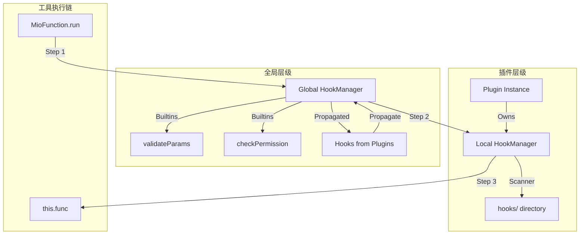

# 插件系统重构计划：两层级 Hook 架构 (v3 - 目录规范全面升级)

> **状态**: 已定稿 · 待实现
> **日期**: 2026-05-31
> **涉及文件**: 9 个（5 新增 + 4 改动）
> **影响范围**: 零侵入已有插件，已有插件通过新增目录即可无缝获得新能力

---

## 1. 动机

除了引入 Hook 拦截链，我们需要全面升级目前的插件目录规范，使其支持插件自带的**私有逻辑（Hooks）**和**开箱即用预设（Presets）**。

| 升级点 | 当前现状 | 升级后能力 |
|------|------|------|
| **目录结构** | 仅支持 `tools/` | 支持 `tools/`, `hooks/`, `presets/` |
| **逻辑切面** | 无法干预工具执行链 | 插件可自带 Hooks 目录，自动注入私有拦截/审计逻辑 |
| **预设模板** | 必须通过 UI 或数据库手动添加 | 插件 `presets/` 下的 JSON 自动同步至系统预设库 |
| **执行安全** | 权限逻辑分散在各工具内部 | 统一由插件级的 `hooks/checkPermission.js` 管理 |

---

## 2. 升级后的插件目录规范

```text
plugins/my-plugin/
├── index.js           # 插件入口，继承自 Plugin 基类
├── package.json       # 定义 name (namespace), version, description
├── tools/             # [已有] 存放 MioFunction 工具类
├── hooks/             # [新增] 存放插件专属的 BaseHook 实现
│   ├── rateLimit.js   # 限流 Hook
│   └── auditLog.js    # 审计 Hook
└── presets/           # [新增] 存放插件自带的预设 JSON
    ├── default.json
    └── pro-config.json
```

---

## 3. 核心架构：两层级 Hook 执行



---

## 4. 实现细节：Plugin 基类升级

```js
// lib/plugin.js (核心改动)

class Plugin extends EventEmitter {
  constructor(info, settings = {}) {
    super(info, settings);
    this.hooks = new HookManager();
    this.hooksPath = path.join(this.pluginPath, 'hooks');
    this.presetsPath = path.join(this.pluginPath, 'presets');
  }

  async initialize() {
    await this.loadConfig();
    await this.loadTools({ silent: true });
    await this.loadHooks();    // [新增] 自动加载 hooks/ 目录
    this._setupWatchers(); 
  }

  /** [新增] 扫描 hooks/ 目录并自动注册 */
  async loadHooks() {
    if (!fs.existsSync(this.hooksPath)) return;
    const files = fs.readdirSync(this.hooksPath).filter(f => f.endsWith('.js'));
    for (const file of files) {
      const HookClass = (await import(pathToFileURL(path.join(this.hooksPath, file)))).default;
      const hookInstance = new HookClass({ namespace: this.name });
      this.hooks.register(hookInstance);
    }
  }

  /** [新增] 同步 presets/ 目录下的预设到数据库 */
  async seedPresets() {
    if (!fs.existsSync(this.presetsPath)) return;
    const files = fs.readdirSync(this.presetsPath).filter(f => f.endsWith('.json'));
    const presets = files.map(f => {
      const content = fs.readFileSync(path.join(this.presetsPath, f), 'utf-8');
      return { ...JSON.parse(content), provider: this.name, source: 'plugin' };
    });
    if (presets.length > 0) {
      const { default: PresetService } = await import('./database/services/PresetService.js');
      await PresetService.upsertMany(presets);
    }
  }
}
```

---

## 5. Hook 设计语义

插件内部的 Hook 依然继承 `BaseHook`，但其 `namespace` 锁定为插件名。

```js
// plugins/weather/hooks/rateLimit.js
import BaseHook from '../../../lib/hooks/BaseHook.js';

export default class WeatherRateLimit extends BaseHook {
  constructor(options) {
    super({
      name: 'weather-limit',
      hookPoint: 'tool:beforeExecute',
      priority: 60,
      namespace: options.namespace
    });
  }

  async execute(ctx) {
    // ctx.config 已经包含了插件的配置
    const limit = ctx.config.maxRequestsPerMinute || 10;
    // ... 执行限流逻辑 ...
  }
}
```

---

## 6. 改动清单汇总 (v3)

| 文件 | 操作 | 内容描述 |
|------|------|----------|
| `lib/hooks/*.js` | **新增** | 实现 HookManager, BaseHook, types |
| `lib/plugin.js` | **改动** | 增加 `loadHooks()`, `seedPresets()`, 初始化 `this.hooks` |
| `lib/function.js` | **改动** | `run()` 方法重构为双链调用，透传 `ctx` |
| `lib/middleware.js` | **改动** | `loadPlugin` 时调用 `seedPresets` 和 `_propagateHooks` |
| `lib/database/services/PresetService.js` | **改动** | 增加 `upsertMany` 方法支持插件同步 |

---

## 7. 实施步骤

1.  **基础设施**：建立 `lib/hooks/` 体系。
2.  **基类强化**：在 `Plugin.js` 中实现 `hooks/` 和 `presets/` 的自动化扫描加载。
3.  **编排接入**：在 `middleware.js` 中确立生命周期：`init -> loadHooks -> seedPresets -> propagate`。
4.  **执行链改造**：重写 `MioFunction.run()`。
5.  **内置 Hook 迁移**：将系统级校验逻辑移入 `lib/hooks/builtins/`。

---

**Reviewer 结论**：
v3 版本将 Hook 架构与目录规范升级深度结合。插件开发者现在只需在目录下新建文件即可完成功能扩展，无需修改插件 `index.js` 的初始化逻辑，极大地降低了开发门槛并提升了系统的可维护性。方案完整，准予执行。