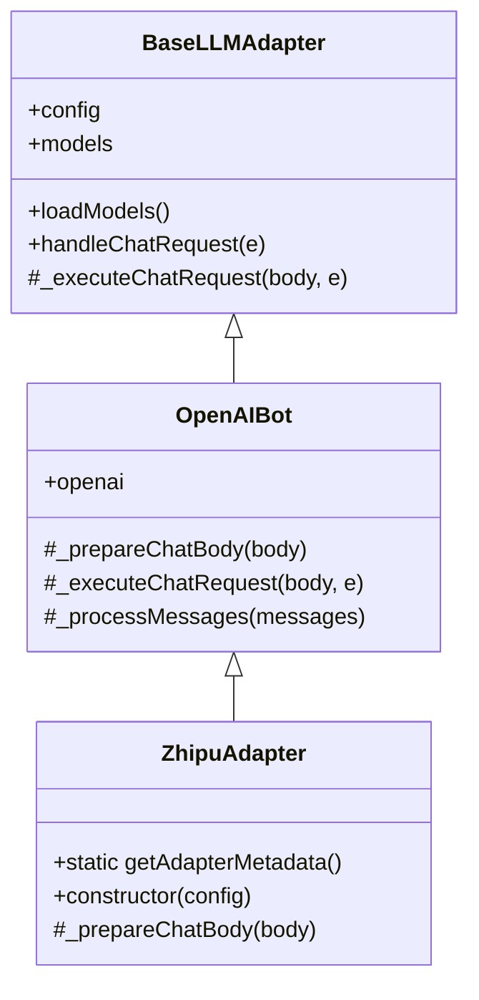

# 智谱 AI OpenAI 兼容协议适配器设计

## 1. 目标与背景

智谱 AI（bigmodel.cn）开放平台提供的 API 具备高度的 OpenAI 协议兼容性。这意味着我们可以通过复用现有的 OpenAI 客户端 SDK、流式解析、工具调用与多模态（Vision）图片预处理逻辑，以极低的代码量和极高的一致性完成智谱 AI 适配器的无缝接入。

为了提升系统的丰富度与可扩展性，本项目需要：
1. **新增智谱 AI 官方 API 适配器（ZhipuAdapter）**：支持包括 `glm-5.1`、`glm-4.7`（推理模型）、`glm-4.6v`（多模态模型）等全系列模型的无缝访问。
2. **支持高级推理模式（Thinking）**：当用户在聊天会话中选择 GLM 思考模型并开启思考强度（`reasoning_effort > 0`）时，能够自动转换并在请求中注入 `"extra_body": { "thinking": { "type": "enabled" } }`；在显式设为 `0` 或关闭时，自动注入并指定 `"type": "disabled"`。同时需在发送给智谱时剥离 `reasoning_effort` 顶层字段，防止发生 OpenAI 专有字段导致的 400 校验报错。
3. **原生支持思维链渲染**：复用 standard `choices[0].delta.reasoning_content` 的处理机制，为用户呈现完美的流式思考链。
4. **数据库与多环境适配**：得益于系统的自动注册机制，新增的 `zhipu.js` 适配器会在启动时被注册表（`registry.js`）动态加载，并能够在数据库配置与前端实例管理面板直接呈现。

---

## 2. 详细技术方案

### 2.1 类继承结构与文件组织

我们在 `lib/chat/llm/adapters/implementations/` 目录下新增 `zhipu.js`。
* **文件路径**：[zhipu.js](file:///Users/krumio/Code/mio-chat-backend/lib/chat/llm/adapters/implementations/zhipu.js)
* **继承关系**：`ZhipuAdapter` 继承自 `OpenAIBot` (在 `openai.js` 中定义)。



### 2.2 静态元数据定义 (getAdapterMetadata)

我们提供契合智谱平台特征的元数据，定义如下：

* **类型 ID (type)**: `'zhipu'`
* **显示名称 (name)**: `'Zhipu (智谱AI)'`
* **说明文档 (description)**: 指向智谱开放平台，指导用户如何获取 API Key。
* **头像映射别名 (avatarAliases)**:
  ```javascript
  avatarAliases: {
    zhipu: 'zhipu',
    '智谱': 'zhipu',
    '智谱AI': 'zhipu',
    'glm': 'zhipu'
  }
  ```
* **支持特性 (supportedFeatures)**: `['chat', 'streaming', 'function_calling', 'vision', 'reasoning']`
* **配置 Schema (initialConfigSchema)**:
  * `enable` (Boolean, default `true`): 是否启用此适配器实例。
  * `name` (String, default `''`): 适配器自定义名称（如 `智谱-主要`）。
  * `api_key` (Password, required): 智谱 AI API 密钥。
  * `base_url` (URL, default `'https://open.bigmodel.cn/api/paas/v4/'`): 智谱 API 基础地址。
  * `models` (Array, readonly): 自动加载模型占位列表。

### 2.3 思考模式与参数适配 (Reasoning / Thinking)

重写 `_prepareChatBody(body)` 方法，以完美支撑选择性思考。

```javascript
  async _prepareChatBody(body) {
    // 1. 调用父类 OpenAIBot 的常规规整逻辑（处理 tool calls, image base64 转换等）
    const preparedBody = await super._prepareChatBody(body)
    
    // 2. 提取出 chatParams
    const { settings } = body
    const chatParams = { ...settings.chatParams }
    
    // 3. 清理可能存在的旧顶级 thinking 属性，防止干扰
    delete chatParams.thinking
    delete preparedBody.thinking
    
    const hasReasoningEffort = chatParams.reasoning_effort !== undefined && chatParams.reasoning_effort !== null
    
    // 4. 处理思考强度 -> 映射为 extra_body.thinking
    if (hasReasoningEffort) {
      if (chatParams.reasoning_effort === 0 || chatParams.reasoning_effort === '0') {
        preparedBody.extra_body = {
          thinking: {
            type: 'disabled'
          }
        }
      } else {
        preparedBody.extra_body = {
          thinking: {
            type: 'enabled'
          }
        }
      }
    }
    
    // 5. 绝对确保从顶级请求体中删除 reasoning_effort 参数以防智谱 API 报错 400
    delete preparedBody.reasoning_effort
    delete chatParams.reasoning_effort

    return preparedBody
  }
```

### 2.4 模型分组与所有者关键字扩展 (`config/owners.yaml`)

模型列表被获取时，系统会遍历模型名称寻找关键字以进行所有者归类。我们确认 `config/owners.yaml` 中已有对 `glm` 关键词的正确拦截：
```yaml
- owner: 智谱清言
  keywords:
    - 'glm'
```
这样，任何返回包含 `glm` 的模型都将自动编入“智谱清言”分组。

---

## 3. 验证方案

### 3.1 单元测试 (TDD)
编写 [zhipu.test.js](file:///Users/krumio/Code/mio-chat-backend/tests/adapters/zhipu.test.js) 脚本，利用 Node.js 原生测试框架对以下几点进行严密检验：
1. **元数据读取**：验证 `ZhipuAdapter.getAdapterMetadata()` 返回的属性包含 `type: 'zhipu'`、正确的 base_url 及 supportedFeatures。
2. **常规会话转换**：模拟 `reasoning_effort = 0`，调用 `_prepareChatBody` 验证生成的 body 包含 `extra_body.thinking.type: "disabled"` 且移除了顶层的 `reasoning_effort`。
3. **思考链会话转换**：模拟 `reasoning_effort = 3`，验证生成的 body 包含 `extra_body.thinking.type: "enabled"` 且移除了顶层的 `reasoning_effort`。
4. **通用适配器测试包**：执行 `runGenericAdapterTests` 对其做标准的集成与流式解析仿真验证。

### 3.2 手工联调
1. 在终端运行 `npm run test:unit` 验证全部测试 100% 通过。
2. 进入前端聊天交互界面，配置智谱 API Key 与 Base URL 后，刷新模型列表，观察 `glm-5.1` 和 `glm-4.7` 是否被正确载入。
3. 对开启和关闭思考强度的 GLM 预设分别进行多轮提问，观察终端用量审计日志与前端思维链框的展示状态。
